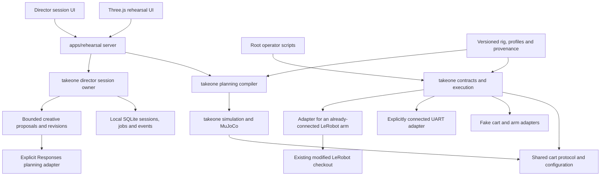

# TakeOne architecture decision — 2026-09-11

**2026-09-12 execution update:** the synchronous batch executor has been replaced by a finite prepared-plan service with independent cart/phone/light workers, one monotonic start epoch, measured joint tracking, explicit live qualification and a motor-bus-only LeRobot adapter. See [robot motion execution](robot-motion-execution.md) for current behavior and the source/recovery mapping. Planning and simulation remain separate from device IO; the website prepares plans without actuating hardware.

TakeOne becomes a modular product package with a thin simulator application. The modified LeRobot Git checkout remains at `lerobot/`: its source changes and Python 3.12 environment are independent from the lightweight Python 3.13 simulator. Moving that checkout adds risk without improving tomorrow's test. Revisit its location only after a clean hardware installation and patch/upstream strategy have been verified.

Product logic cannot import the web application. Simulation cannot open serial ports. Hardware imports are lazy and construction is disconnected. The arm adapter accepts an explicitly supplied, already-connected follower; it does not run LeRobot's connect/configure/calibrate sequence. A complete live arm bring-up and combined replay remain blocked on verified calibration-to-model mapping and measured limits. Fake adapters exercise the execution contract without claiming hardware behavior.

The [Director session foundation](ai-director/implementation/01-session-foundation.md) is now implemented in `packages/takeone/director`, with an HTTP adapter and authored UI in the existing app. One state owner accepts scoped, expiring, idempotent commands and commits session/event/job changes atomically. Restarted work requires reconciliation. Its fixture demonstration exercises future workflow states without claiming real planning, media or device acknowledgements. There is no Director-to-motor bridge in this slice; the timed cart runner remains independent.

[Creative planning, package 02](ai-director/implementation/02-creative-planning.md), adds a brief/script/shot editor and one bounded background Responses worker under that same owner's lease. Strict proposals carry named actors/marks, proposed media-relative milliseconds, dialogue alternatives and camera/light/edit intent. The schema-v2 SQLite migration adds creative context, immutable creative revisions and budgeted planning requests without replacing foundation records. Editing a script invalidates its approval and dependent preview/take references; capture-active stages reject edits. Provider jobs never enter a device clock loop, expose motor tools, or qualify motion. Missing credentials produce an explicit unavailable state; manual writing and deliberately selected editorial samples are separate workflows. The full creative-proposal-to-physical-timeline compiler remains package 03.

Canonical geometry is `assets/robots/takeone/`; original validation inputs, upstream license and provenance remain together under `assets/robots/reference/`. Their historical results are reference material, not newly validated limits. The UI's `dist/` contains authored application files as well as served assets; it is not disposable build output.

`configs/rig.json` owns common wheel dimensions and assumptions, `configs/shots/` owns shot defaults, and `configs/devices/` identifies hardware per host. Immutable imported evidence lives in `calibration/evidence/`; missing originals and incomplete derived transforms have explicit status. Run manifests record hashes and distinguish simulated state from measured feedback.

The wheel-end correction preserves the upper cart frame: cart +Y is the filming side; drive +X is cart -X, toward the powered front axle. Passive swivel casters are at cart +X. `dollyOffset` is an editable straight-shot placement in world Y; it is not a hardware measurement. See [the wheel-layout record](wheel-layout-correction-2026-09-12.md).

The migration manifests record each move. The simulator, exporter and verification tools now import the installed TakeOne package directly. The old import shims and sys.path bootstrap are archived and absent from the active app. Packaging installs TakeOne alone; no root Git initialization absorbs the LeRobot repository.

The active planning pipeline is documented in [arm movement design](arm-movement-design.md). Validated immutable settings produce independent target strategies for each arm; bounded IK produces keyframes; the trajectory stage combines joint interpolation with authoritative wheel odometry; forward checks validate every preview frame before serialization. Model/render serialization is in `simulation/robot.py`. Product source hashes are part of plan provenance, captured once per compile.

## Execution boundaries

The executor is a synchronous, bounded single-clock coordinator, with disconnected, preview, connected/disarmed, armed, running, stopping and fault states. It validates freshness, device set and calibration mapping before adapter writes. It does not queue stale commands or drive background hardware loops. Fault handling attempts a cart zero packet and requests the last measured arm pose to hold; if feedback is stale, no new pose is invented. Failed stops remain faults with recorded errors. No automatic torque-disable or automatic restart occurs.

Python-process failure, USB loss, firmware behavior and gravity cannot be solved by this state machine. The user reports a 60 ms firmware loss-of-command watchdog that activates failsafe runaway brakes; physical stopping and firmware receipt timing are still unverified. An independent physical abort procedure and supervised payload support are required before testing. The combined CLI defaults to fake transports and exposes no combined live replay switch.

### Cart-only commissioning

`takeone.cart.plan` calculates and validates the simulator's quantized motor schedule without loading arms or opening ports. Its immutable plan includes the complete timeline, source hashes and an open-loop prediction. `takeone.cart.runtime` owns one finite run on an absolute monotonic timeline, preserves compiled command boundaries, and inserts keepalive writes when necessary. It enforces the timing budget in `configs/cart-runtime.json`, faults on missed deadlines or failed writes, and attempts a logged zero-command shutdown. It never resumes or reconnects automatically.

`takeone.cart.cli` is an explicit operator entry point: prepare, virtual replay, real-clock testing through an in-memory transport, and a separate supervised live test. USB identity, fresh plan validation and a narrow commissioning envelope are checked before connection. No UI, AI call, IK solve, disk logging or arm operation runs in the live command loop. Host timing is not a firmware acknowledgement or measured motion. This path does not make the synchronous combined executor suitable for the 60 ms deadline. See [the cart guide](cart-live-testing.md) for commands and [the architecture critique](architecture-review-2026-09-12.md) for outstanding system gaps.

## Future milestones

1. Hardware qualification: retrieve original calibration, validate signs/zeros/tool transforms, verify the reported firmware watchdog, measure loaded limits and stopping. Use bounded cart-only commissioning to gather cart evidence; add combined live bring-up only when its gates can be enforced.
2. Recorded-run replay: timestamped measured state, encoder/vision pose comparison and measured command-to-speed tables behind the existing adapter contracts.
3. Tracking/localization: observations with source frame, confidence and capture timestamp; planner consumes observations, hardware layer remains unaware of the detector.
4. Recording and new tools: camera/recorder adapters and tool profiles; preserve independent lighting targets and the phone lens transform.
5. Shot-intent/learned policies: generate validated plans through the same planner and execution gates. Model output never writes directly to motors.
