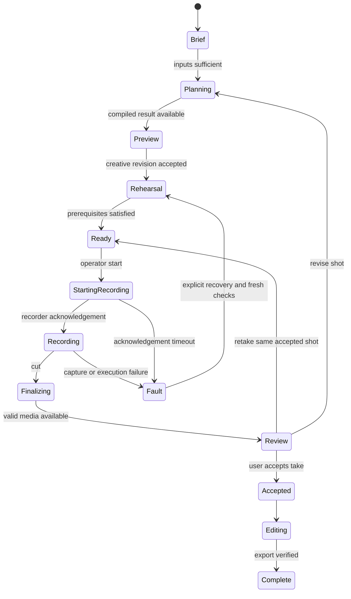

# AI Director implementation and evaluation plan

Companion to [the product and architecture decision](ai-director-decision-2026-09-12.md). This is a coding specification, not implemented functionality. Runtime and cart configuration remain unchanged. Do not alter another operator's active test environment while implementing independent Director work.

Implementation handoff: the [AI Director delivery pack](ai-director/README.md) now provides the current task order, eleven implementation prompts, time-coded example and release gates. It incorporates the user's clarification that performance feedback is delivered after recording and that TakeOne owns the edit. Use that pack for task execution; this document retains the underlying contract and evaluation rationale.

## First demonstrable outcome

One user describes a short performance. The application prepares a clear script and a feasible shot card, shows the existing 3D rig and simple blocking, observes the selected actor through an actual camera, detects one agreed missed beat, gives a useful rehearsal correction, records an acknowledged take, verifies the saved file and presents a review with evidence. The user can accept the original clip and export it without an AI video provider.

Start with one actor and a stationary camera. A microdrama can initially use an offscreen partner or separate coverage. Continuous multi-actor tracking, arbitrary rooms, large cart moves, automated emotional grading and a learned movement policy are later scope.

## Domain contracts

Use immutable, versioned contracts with strict validation and clear ownership. Values use SI units unless explicitly screen-normalized; every geometric field names a frame. All live observations carry capture/receive/process times, clock domain, source, sequence and uncertainty. The live state stores references to evidence rather than rewriting observations to match a plan.

| Contract | Owner | Minimum content |
|---|---|---|
| ProductionBrief | Director | User objective, audience, duration/aspect, story, actors, creative preferences, budget, original-capture and effect intent |
| CapabilitySnapshot | Device/camera services | Supported actions, available streams, known limits, calibration revision, measured/assumed status, capture modes, health and expiry |
| SceneSpec | Scene service | Actor/prop IDs, marks, floor frame, obstacles, intended occlusions, room/camera calibration and unknown regions |
| ShotSpec | Director | Shot purpose, coverage/continuity, camera and lighting intent, actor beats, framing targets, tolerances, motion priority and edit handles |
| CompiledShot | Planner | Plan ID/revision, input hashes, achieved trajectories, full residuals, allowed correction envelope, accepted revisions and execution qualification |
| Observation / SceneSnapshot | Perception | Actual measurements, contributing frames, confidence, cross-camera skew, persistent actor identity and explicit unknowns |
| BeatAssessment | Beat evaluator | Beat ID, SATISFIED/VIOLATED/UNKNOWN, evidence IDs, confidence, attribution and observation expiry |
| DirectorDecision | Reasoning + supervisor | Session/take IDs, expected state revision, proposed typed action, evidence, expiration, cancellation generation and outcome needed |
| TakeRecord | Recorder | Requested/acknowledged start/stop, clock alignment, actual lens/crop/capture settings, clip/audio identity, checksums, duration and integrity status |
| EditPlan / EnhancementJob | Editor | Source take IDs, in/out points, transition/audio plan, effect region/time, preserve/change requirements, budget, provider job ID and derivative lineage |

The distinction between scene and shot matters: one scene may need multiple camera setups. Between shots, represent repositioning and settling explicitly. A cut in the final video cannot teleport the physical rig.

An example actor beat could read: "After the partner's line, pause, turn toward the doorway marker, then hold." Its observable fields define the target marker, allowable head-direction cone, timing window and hold duration. Its performance note could suggest hesitation. The former permits an evidence-based check; the latter is advice for review. Numeric tolerances must come from the camera/scene evaluation and artistic acceptance, not a universal rule about good acting.

## Session ownership and tool semantics

One supervisor changes session state. AI decisions are proposals applied only against their expected revision. Observe/plan/review jobs can run asynchronously; stale results cannot change a newer take.

Add setup, subject loss and reposition/settle substates where they carry behavior; do not use automatic calibration as a session transition. Stop/cancel can preempt pending work. Successful physical stopping and successful media finalization are separate facts.

Initial tools: `inspect_capabilities`, `inspect_scene`, `propose_shot`, `compile_shot`, `preview_plan`, `request_rehearsal`, `request_cue`, `request_record`, `request_cut`, `review_take`, `propose_retake`, `prepare_edit`, `request_enhancement`. Each handler checks the session, revision, allowed operation, deadline and required evidence. The model receives structured results. No raw motor command, torque, shell or arbitrary file-operation tool belongs in the Director's production permissions.

Use a request ID for recording and finishing jobs. A duplicate request queries/reconciles the existing result; it does not start a second take or pay for another generation. Restart recovery begins from persisted state and actual adapter/media status. A process restart cannot automatically restart robot motion. A late recording acknowledgement or voice response must retain its original take and decision identity.

## Module boundaries and deployment

Add behavior incrementally under `packages/takeone`:

| Module | Responsibility |
|---|---|
| `director/` | Brief/shot contracts, skill selection, provider tools, supervisor and decision policies |
| `perception/` | Replay/camera sources, pose/face features, timestamps and selected-subject tracking |
| `scene/` | Calibrated transforms, fused snapshots, identity and uncertainty |
| `coaching/` | Beat checks, correction attribution, persistence/hysteresis and cue lifecycle |
| `recording/` | Capture adapter, acknowledgements, clock association and durable take manifest |
| `editing/` | Edit decisions, original export and explicit enhancement jobs |

Reuse `planning/`, `simulation/`, `adapters/` and existing cart interfaces. Do not copy their mathematics into the Director. Keep the current combined executor's limitations visible until the physical controller is qualified. Do not add an empty framework directory just to match this table.

Use one local application/runtime for session ownership. Isolate heavy visual/provider work from device timing in separate processes where required. Observations use bounded newest-value slots; job commands and acknowledgements use bounded reliable channels with defined backpressure. Persist decisions/media references outside the timed motor loop. Benchmark CPU/GPU contention while video decoding and the 3D preview are active.

A future hosted UI talks to an explicitly paired local runtime. Keep permanent provider keys off the browser, authenticate the local control channel and restrict origins. Pairing authorizes a device session; a web page visit does not authorize motor operation. For the first slice, retain localhost operation and avoid introducing hosting/network-control changes into the active cart test.

## Camera and recording dependency

The existing `configs/reference/recording.json` describes intended roles but provides no live endpoints. Select one concrete phone integration after verifying the actual phone OS and available capture software; old references to an iPhone do not prove the current device is iOS. Required operations are: preview frames with useful timestamps, actual capture settings, explicit start/stop acknowledgement, local original recording and verifiable media transfer. If an integration cannot supply an operation, mark it unavailable.

A laptop webcam may support the first camera-only demonstration, but it cannot be substituted as evidence about the phone's final composition. A stationary phone is sufficient for the first original take. Phone controls, low-latency preview and master recording must be tested together; preview crop, stabilization, auto lens changes, exposure, rolling shutter, thermals and audio synchronization can differ from the 3D view.

## Implementation milestones

1. **Shared shot and skill contract.** Implement strict Brief/Scene/Shot/Beat schemas and three curated skills: static dialogue, reaction/eyeline, and simple prop presentation. Use one selected provider to produce proposals. Reject unsupported primitives and ambiguous directions. Render shot cards and simple actor/prop poses through the existing app.
2. **Camera-only evidence loop.** Implement replay plus one actual camera source, selected actor locking, timestamps and local pose/framing features. Demonstrate wrong-way movement, missed mark and UNKNOWN under occlusion without motor access.
3. **Coaching and conversation.** Add cached cues and the single-instruction gate. Integrate GPT-Live client delegation with the existing supervisor and selected backend. Test cancellation, dialogue-versus-operator channel separation and quiet recording policy. An unavailable provider must not generate a fake success.
4. **A real take and review.** Implement one actual recorder adapter. Acknowledge recording before the action window; verify stop, file existence, decode, duration and audio. Review footage with timestamped evidence and return useful limited feedback. Let the user accept/retake. Export original media using a conventional edit.
5. **Qualified robot assistance.** Once independent cart/arm evidence permits it, fix full tool-position acceptance and validate measured-state start/stop transitions. Implement bounded incremental framing correction and arm-first allocation. Keep the 50 Hz cart sender independent. Do not call the full-shot IK compiler on every frame or retime serialized wheel packets to follow the actor.
6. **AI finishing.** Verify provider access and input limits, submit only accepted clips with preservation/change requirements, preserve originals and check generated outputs. Support explicit manual export/import if the selected API is unavailable; display that workflow clearly. Expand actors, rooms and movement skills only after the preceding loop works reliably.

Milestones 1–4 can proceed while hardware testing continues, with a separate observation/capture environment. Package installation or performance tests on the same machine should be scheduled so they do not disturb an active physical run. There is no need for another root-folder reorganization.

## Evaluation before choosing more models

Create a permissioned, annotated evaluation set rather than relying on a provider's general benchmark score. Start with 30 varied briefs and at least 60 short labeled performance clips spanning multiple actors and setups. These are proposed pilot sizes, not evidence of statistical coverage. Separate calibration/development data from held-out actors and rooms; neighboring frames from one take must not straddle training and test sets.

Compare the selected cloud baseline with Qwen3.5-4B for each relevant task, and compare a visual-review baseline with Gemini Robotics ER 2 for ambiguous progress questions. Run candidates on the same evidence. Do not compare native full video for one model with a single random frame for another and report an unqualified winner; document the input/cost differences.

| Evaluation | Report / initial acceptance objective |
|---|---|
| Brief to shot | Schema validity, constraint violations, creative usefulness and unwanted assumption rate; every invalid physical request rejected by local validation |
| Observable beat checks | Precision, recall and UNKNOWN coverage per beat; target at least 95% precision for spoken error corrections, then assess recall |
| Identity | Track crossings, intentional exits and reacquisition; zero silent identity switches in the release scenario suite |
| Coaching quality | False/unhelpful cues per minute, human response, repeated cues and actor preference; target no more than one false cue per ten rehearsal minutes in the pilot |
| Subjective review | Human-rated usefulness and agreement on evidence; avoid a single automatic "acting score" |
| Latency | Full capture-to-observation and event-to-cue distributions; proposed p95 observation age ≤100 ms and cached cue onset ≤150 ms after gating |
| Voice | p50/p95/p99 end-of-speech to first audible response, interruptions and mistaken control intent; initial p95 target ≤1 second |
| Recorder | Requested/acknowledged state, take ID, media integrity and start offset; no successful-take status without valid captured media |
| Concurrency/faults | At least ten minutes of replay/observation with slow provider, dropped frames, bad clocks, network loss and late replies; bounded queues and no stale accepted action |
| Economics | Cost per accepted take, local inference time/memory, active voice minutes, cloud visual inputs and finishing retries |

Unknown is a valid outcome, but hiding difficult cases as unknown can inflate precision. Always publish unknown coverage and recall alongside precision. Report pilot sample sizes and uncertainty. A general benchmark or one fast demonstration is insufficient to declare a model best for this product.

Keep software unit/integration tests separate from real-camera/provider/hardware observations. Run the root test command after relevant implementation changes. Tests for failure paths should verify actual state transitions and absence of stale actions, not merely reassert constants.

## High-value failure scenarios

- Person B crosses actor A; actor A disappears and returns; the system keeps identity or explicitly loses it.
- A scripted exit succeeds, while an accidental occlusion remains UNKNOWN.
- Actor direction, camera-screen direction and room axes disagree; the cue names an unambiguous mark.
- The actor says a scripted "cut" or "stop"; the transcript cannot issue operator commands.
- A face is small, turned away or poorly lit; no unsupported emotion/eyeline judgement is spoken.
- The actor meets the beat but the rig cannot frame it; feedback attributes the limitation correctly.
- Provider result arrives after a retake or revision; it is discarded or attached to its original evidence.
- Phone preview freezes, master recording fails, file transfer is interrupted or disk is full; the session cannot claim a valid saved take.
- A finishing job times out; its provider job ID is reconciled before any new paid submission.
- A detector jitters during qualified movement; the base does not oscillate in response.

## Definition of the first complete Director

The user supplies a brief and gets an original playable take with useful rehearsal, a verifiable recording and a review, without manually carrying messages between subsystems. Every displayed success is backed by the responsible component's evidence. Robot movement and generated finishing are separate capabilities with explicit readiness. The next development task should implement this vertical slice, not expand the prompt or scaffold dozens of agents.
