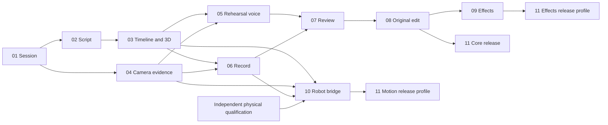

# AI Director delivery plan

Date: 2026-09-12. Planning baseline: current TakeOne package, simulator, cart commissioning workflow and the user's latest six decisions.

## Product decision

TakeOne helps a person turn an idea into a performance they can actually film: explain the shot, help with the words, rehearse, capture, review and edit. The robot extends the shots that can be captured once its movement is qualified. Generated effects decorate selected accepted footage.

We should own the connection between intention, actor instructions, feasible camera work and the resulting take. A universal video-generation studio would put us in direct competition with much larger model and editing platforms before this connection works.

The first demonstration is a short product presentation with one actor and a stationary shooting camera. Then demonstrate a dialogue scene using separate coverage and an offscreen partner. Simultaneous multi-person blocking, arbitrary room reconstruction and freely moving cameras come later. These are deliberate product scopes, not automatic substitutions when a requested feature fails.

## Latest requirements made concrete

| Requirement | Product behavior | Owner |
|---|---|---|
| Describe what happens from 0:01 to 0:04 | One timeline with actor action, dialogue, lens/framing intent, derived arm movement, cart intent, light target and edit/VFX annotations | 02, 03 |
| Actor does not know what to say | Offer short, speakable alternatives based on supplied facts; let the actor choose and rehearse | 02, 05 |
| Explain and demonstrate the scene | Shot cards plus the built-in 3D rig, simple marks, actor proxies and camera preview | 03 |
| Understand what happened | Timestamped observations, beat checks and evidence linked to the selected actor and actual take | 04, 07 |
| Review after recording | Silence ordinary coaching from capture-start request through confirmed stop; review after media finalization | 05, 06, 07 |
| Own editing and add effects | Conventional edits from original takes; effects are explicit derivative jobs on selected ranges | 08, 09 |
| Use arms more and avoid twitchy turns | Geometry-driven framing with arm preference inside validated limits; differential-drive feasibility and independent timing | 03, 10 |
| Work without Astra running the app | Runtime API/local model adapters plus local deterministic planning; no dependency on an interactive Codex session | 01, 02, 05, 07, 11 |

Examples and default durations are editable intentions. Timing does not require the actor to reproduce an animation frame for frame. See the [worked example](timeline-example.md).

## Delivery order and ownership

Suggested roles describe responsibility; they do not assume an existing team or authorize launching parallel coding agents. With one implementer, follow the numbered sequence through 08, perform the core release evaluation, and add 09/10 when their dependencies are available.

Effort is relative: S is contained, M spans a few modules, L combines device/model/UI behavior. These are planning estimates, not calendar promises. Re-estimate after 01 and the actual phone integration spike in 04.

| ID | Work package | Depends on | Responsible role | Effort | Demonstration that closes it |
|---|---|---|---|---|---|
| 01 | Session foundation | Existing architecture | Backend/platform | M | Resume an offline session; duplicate and stale requests cannot change the wrong take |
| 02 | Brief, skills and script | 01 | Applied AI + product | M | A rough idea becomes editable script and feasible shot proposals; missing product facts stay unknown |
| 03 | Time-coded previs | 01, 02 | Planning + frontend | L | Scrubbing one shared timeline drives actor cues and the existing 3D preview; infeasible motion is explained |
| 04 | Cameras and scene evidence | 01 | Vision + capture | L | A real camera tracks the selected actor and reports loss/uncertainty correctly |
| 05 | Rehearsal and voice | 02, 03, 04 | Applied AI + interaction | L | Actor can ask for a line; one useful rehearsal cue is spoken without chatter or stale replies |
| 06 | Recording | 01, 03, 04 | Capture + backend | L | Start/stop acknowledgements produce a verified original clip associated with the accepted shot |
| 07 | Review and retake | 02, 04, 05, 06 | Applied AI + product | M | After each take, evidence-linked feedback helps the actor accept it or try again |
| 08 | Original editor | 01, 06, 07 | Media + frontend | L | Accepted footage becomes an editable, captioned, playable export without generated video |
| 09 | Generated effects | 08 | Provider integration + media | M | One selected clip becomes a reviewed derivative with recorded cost and preserved source |
| 10 | Physical robot bridge | 03, 04, 06, independent qualification | Robotics/control | L | Qualified execution is reconciled with actual recording and measured state |
| 11 | Release evaluation | 01–08; add 09/10 for their profiles | QA + product owner | M | Reproducible report states which complete workflows passed on which devices and models |

04 can proceed after 01 while 02–03 are built. 06 can proceed while 05 is built. Separate owners must agree on contract ownership and avoid simultaneous edits to shared files. Cart evidence collection is an external dependency of 10, not a reason to rewrite the cart runtime during Director development.

## Milestones and exit criteria

**M1 — A plan the user understands, 01–03.** The user can edit a brief, select suggested lines and scrub actor/camera/light directions in the simulator. Requested and achieved motion differ visibly where needed. No preview is described as physical readiness.

**M2 — One useful filmed take, 04–07.** The Director sees the selected actor, coaches in rehearsal, records through a verified adapter, stays quiet during capture and reviews saved media. Acceptance belongs to the user. A simulated recorder cannot close this milestone.

**M3 — Finished original video, 08 + core 11.** The user chooses takes, changes a cut in natural language, previews the change, exports and plays a final video. All ranges resolve to real source media. Failure of a cloud generation service cannot prevent this workflow.

**M4 — Optional expansion, 09 and/or 10 + corresponding 11 profile.** Effects and movement have separate evidence. An effects demonstration proves nothing about arm qualification. A timed UART test proves nothing about coaching or clip integrity.

## Architecture to implement

The logical Director is one product role. It consists of a reasoning service, a deterministic session supervisor and bounded tools. It does not require a collection of autonomous agents debating every action.

- **One session owner:** a state machine applies validated proposals against the current revision. Persist session changes and their related event in one local transaction; SQLite is sufficient initially. Keep large media as referenced artifacts.
- **Contracts and adapters:** strict typed inputs separate the model, camera, recorder and existing motion code. Application code depends on contracts. The UI displays outcomes and invokes use cases.
- **Explicit policies:** filming skills, beat checks and correction selection are small strategies with declared inputs, limits and versions. Do not create a generic plugin framework ahead of a concrete use case.
- **Commands with identity:** requests carry session/take/plan IDs, expected revision, expiry and cancellation identity. Request receipt and action acknowledgement are different events. Persist external job identity before accepting its completion.
- **Bounded processing:** latest observations can replace older ones. Record/cut/job acknowledgements need reliable bounded delivery. Slow AI, decoding, rendering and disk writes cannot occupy the device timing path.
- **Evidence and validation:** stages return achieved results, uncertainty and failures. Keep requested, simulated, observed and transmitted facts distinct. Reuse the existing planner instead of copying equations into prompts or UI code.

Keep the local app and package architecture. Add populated modules under `packages/takeone/director`, `scene`, `perception`, `coaching`, `recording` and `editing` as their packages implement behavior. Extend `planning` and existing adapters where appropriate. Avoid a simultaneous framework migration, microservice fleet, vector database, message broker and root-folder reorganization.

The app progresses through brief, plan, preview, rehearse, ready, starting-recording, recording, finalizing, review, accepted and editing states. Job state is separate from session state. Stop/cancel preempts work; restart reconciles facts and never resumes robot motion automatically.

## Model and provider policy

Retain the selected baseline in the architecture decision: structured reasoning for planning and evidence-based review, conversational voice for setup/rehearsal/review, and local geometric measurements. Implementation must verify named models' current API contracts and account access. Development fixtures are explicit test inputs, never a silent replacement for a failed live provider.

Keep generation out of the planning dependency chain. The authoritative scene/shot timeline generates the 3D rehearsal directly. A generated demo can illustrate style, but it is not reverse-engineered into actuator commands.

For finishing, first evaluate Aleph 2.0 on short real clips; evaluate Seedance 2.5 separately for the desired effect. Both have documented Runway API routes as of this research, but this account has not been tested. A reference-conditioned generation is not automatically a precise edit. See [provider decisions](provider-decisions.md).

Train no foundation model now. After collecting a permissioned evaluation set, consider a small local model or narrow beat/correction model only if it improves measured quality, latency or cost. Do not install GPU packages into the cart or LeRobot environment.

## Release measurements

These are proposed pilot gates, not existing performance results. Report sample counts and uncertainty; do not describe zero failures in a finite suite as a mathematical guarantee.

| Area | Initial gate or required evidence |
|---|---|
| Contracts | Malformed plans, unsupported capabilities and stale decisions are rejected in the scenario suite |
| Identity | No silent actor switches in the selected-actor crossing/loss/reacquisition suite |
| Coaching | At least 95% precision for spoken observable-error corrections in the labeled pilot; also publish recall and UNKNOWN coverage |
| Interruption | No ordinary coach output from record request until confirmed stop; no scripted dialogue interpreted as an operator command |
| Rehearsal timing | Measure p50/p95/p99; proposed p95 observation age ≤100 ms and cached cue onset ≤150 ms after the persistence gate |
| Conversation | Proposed p95 detected-end-of-speech to first audible answer ≤1 second, with network/device conditions reported |
| Review | Factual problems have evidence intervals; subjective advice is labeled; target first useful review ≤10 seconds after a ≤15-second clip becomes locally available |
| Capture | Successful takes require acknowledged lifecycle and decoded media with correct identity, duration, timing and audio status |
| Editing | Source-to-output time mapping, original preservation, reliable undo and decodable export |
| Concurrency | At least ten minutes of camera/replay plus UI and delayed providers with bounded queues, no stale accepted results and recorded resource usage |
| Economics | Cost and latency per accepted take and finished minute, including voice time, failed attempts, review, effects and local compute |

The review target is a new product target to validate; observations can prepare evidence while recording, but evaluative feedback is delivered afterward. Deliberate persistence delays, media transfer and model time remain separate in telemetry. Never add independent p95 values and call that a measured end-to-end percentile.

## Risks that need explicit decisions

| Risk or missing fact | Owner | Resolution before dependent release |
|---|---|---|
| Actual phone OS, remote controls and preview/master relationship unknown | 04, 06 | Verify one supported integration and record what it can acknowledge |
| Unmeasured room/camera transforms | 04 | Separate screen observations from metric positions; use measured setup for metric claims |
| Current tool-position residual acceptance incomplete | 03, 10 | Validate achieved FK position and aim; show infeasibility without changing the requested goal |
| Arm mapping, loaded limits and cart stopping unqualified | Hardware team, 10 | Obtain evidence; do not convert simulator joints into servo goals from assumptions |
| Speech contaminates takes | 05, 06 | Gate audio through recorder lifecycle and test queued/late responses |
| Generated changes alter face, product or dialogue | 09 | Source comparison and explicit derivative acceptance |
| Provider latency or cost exceeds target | 11 | Measure complete tasks, reduce needless calls, then compare alternatives on the same evaluation set |

## Scope discipline and handoff

Exclude general-purpose autonomous browsing, arbitrary shell tools, automatic posting, training from scratch, unseen-room autonomy and zero-latency promises. Add capability when a user workflow and acceptance gate require it.

Each task leaves an implementation record under `docs/ai-director/implementation/` with changed files, contracts affected, commands, evidence, test results and blockers. Create this directory when the first record exists. Keep status in [the manifest](work-packages.json) aligned with evidence. Completion means the intended user workflow works; scaffolding and green unit tests alone are insufficient.
