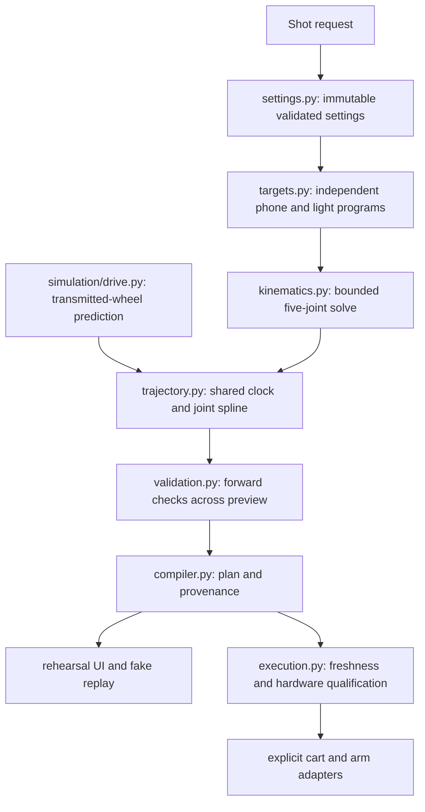

# Arm movement design

The planner describes the desired camera/light result first, then solves the five real joints. It never treats a camera pan as a single servo command or sends preview radians directly to hardware.

## Read the code in this order



The compiler is the application service that calls these stages in order. Rendering/mesh serialization lives in `simulation/robot.py`, separate from the arm solver. Simulation modules do not import the application or planning modules. No compatibility imports or sys.path bootstrap are used by the active app.

## Motion vocabulary and current implementation

| Intent | Implemented behavior | Where to configure/use |
|---|---|---|
| Track an actor | Hold a preferred tool position relative to the moving cart and aim at the world-space subject target | `TrackingMotion.at()`; default for both arms |
| Sweep | Translate from minus half to plus half the requested distance along cart X | Camera `armTravel`; light `lightTravel` |
| Lift / lower | Rise smoothly to the requested lift at mid-shot, then return to the starting height | Camera `armLift`; light `lightLift` |
| Combine sweep and lift | Compose both translations while maintaining subject pointing and horizon preference | Same tracking program; not a separate controller |
| Hold a world-space target | Keep one explicit position and look-at point while solving joint compensation for cart travel | `FixedWorldTarget`, available to code through `TargetStrategy`; not a UI preset |
| Joint hold / manual jog | Physical servo hold uses a fresh measured pose through the qualified adapter; a movement planner does not guess the pose | Existing execution/adapter contract; live bring-up remains gated |
| Optical roll / Dutch angle | No independent roll-shot control is exposed yet. Wrist roll currently participates in the IK horizon preference | Requires measured lens transform, cable limits and a specified horizon target before adding a preset |

Pan and tilt are achieved by solving the pointing constraint, not by assuming one motor rotates around the lens. All five joints can participate. A five-joint arm generally cannot meet six arbitrary position/orientation constraints, so the solver uses weighted position, pointing, horizon and continuity objectives, then independently measures the result. A converged optimization result is not automatically a feasible shot.

The phone has logical joints shoulder pan, shoulder lift, elbow flex, wrist flex and wrist roll. The recorded motor IDs are 1,2,3,4,6. The light uses the same logical joint order with IDs 1,2,3,4,5. Those identities belong to the device/calibration layer; they are not encoded into camera-space motion curves.

## One motion clock, independent arm programs

For normalized shot phase `u`, the translation uses `s(u) = 10u³ - 15u⁴ + 6u⁵`:

```text
cart_relative_x = sweep_m * (s(u) - 0.5)
height_addition = lift_m * sin(pi * s(u))²
world_position = cart_transform * (preferred_local_position + translation)
```

The default camera requests a 16 cm sweep and 4 cm lift. The light independently requests 12 cm and 3 cm. These happen to preserve the previous 75% lighting motion, but the light's values are now explicit settings and changing the camera no longer silently changes the light. The UI exposes all four values and includes an “Arm movement plan” explanation. Both comparison presets set all four values explicitly.

After the wheel-end correction, drive forward is cart -X while filming forward remains cart +Y. The straight preset specifies its cart-center midpoint with `dollyOffset` in world Y (default 0.40 m). The planner derives the axle path from that cart path and the signed axle offset, then integrates the wheel commands. This separates shot placement from wheel geometry. The corrected default produces about 51.1° phone pan and 39.8° light pan with zero base yaw; the upper mounts, IK implementation and validation thresholds are unchanged.

The light targets the subject 15 cm below the camera's aim point. The phone's preferred cart-relative forward position is 0.38 m; the light's is -0.12 m. These are preview preferences, not measured optical transforms. The entire light-arm bound must remain behind the lens plane for the clearance screen to pass.

## Solver and validation

Each compile owns one model and private solver scratch state. The previous solved joints seed the next sample for continuity. There are 81 IK keyframes for each arm and 321 preview frames on one timeline. Cart poses always come from wheel odometry; the joint spline cannot steer the cart onto an unachievable requested path.

The solver rejects invalid seeds, coincident look-at targets, undefined vertical horizon targets and non-finite results explicitly. It does not clip a bad seed, substitute a neutral pose or retry another model. A finite unconverged result remains visible as a failed convergence screen; it never becomes a passing plan by assumption. Failed predictions may still be inspected in the preview with their failed checks shown.

Forward kinematics checks optical aim and height on all 321 preview frames, including between the original solve points. Joint range, speed, acceleration and jerk are evaluated over the interpolated plan. Detailed inter-arm distance and inverse-dynamics screens remain explicitly sampled every eight preview frames; they are not continuous collision or certified load proofs. Whole-light bounds are checked at every preview frame.

The default moving shot is a continuous tracking segment with nonzero arm boundary velocities. Physical transitions from a measured starting pose and into a supported stop remain unqualified. Missing original calibration and servo-to-model mapping continue to block live execution.

## Patterns used and why

| Pattern | Concrete use |
|---|---|
| Immutable value objects | `ShotSettings`, `ArmSpec`, `ToolTarget`, `TrackingMotion`, `IKResult` |
| Strategy | `TargetStrategy` supports actor tracking and an explicit fixed world target |
| Composition | Sweep, lift and subject pointing combine into one target program |
| Application service / pipeline | `compile_shot()` coordinates stages and serializes the result |
| Dependency injection | Solver owns a supplied model; trajectory takes explicit strategies; executor takes adapters and clock |
| Ports and adapters | Cart/arm protocols separate real transports from deterministic test doubles |
| State machine | Explicit disarmed, armed, running, stopping and fault transitions in execution |

There is no plugin-discovery framework, service locator, event bus or chain of alternate implementations. Add a strategy only for a real new motion requirement. Add a hardware adapter only for a real device. A missing required input produces a clear error.

## Efficiency and quality

The expensive solve is performed once per arm/keyframe, seeded from its predecessor. Geometry is indexed once per evaluation. A single provenance snapshot is captured per compile and reused for plan identity. Source hashes now cover the product modules as well as configuration, models and calibration, so changing a target strategy changes the plan identity.

The first before/after measurement on this machine was 0.97 s versus 0.94 s; that difference is too small to claim a speed improvement. The full default joint/cart arrays matched exactly. Reproduce the checks with `scripts/TakeOne.ps1 -Command test`; this also runs the pinned Ruff lint and formatting checks. Tests include independent arm changes, strict invalid inputs, failed solver status, between-keyframe aim errors, geometry/odometry regressions and real-wire behavior through mock transports.

## Adding a movement

1. Specify frame, units, position/aim behavior and endpoint meaning. Distinguish a camera result from a joint command.
2. Implement a pure `TargetStrategy`. Require explicit targets; do not silently substitute one strategy for another.
3. Pass one strategy for each named arm to `solve_trajectory`. Use the same wheel-derived cart timeline.
4. Test the target geometry analytically, then verify solved FK residuals and motion/clearance checks, including between keyframes.
5. Add an intentional request field/preset only once its meaning and bounds are documented. Update both browser controls and serialized outline.
6. Keep physical qualification separate: original calibration, signs/zeros, tool transforms, cable/load limits and start/stop execution must be supported by hardware evidence.
