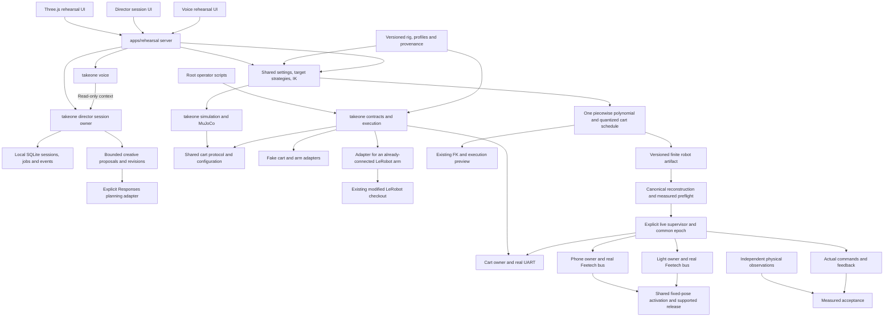

# TakeOne architecture

Updated 12 September 2026. Product code lives in `packages/takeone`; the existing rehearsal app is its offline client. The independent LeRobot source, Git database and hardware environment are preserved. See [repository contents](repository-contents.md) for cloning and the [real robot implementation record](real-robot-implementation-2026-09-12.md) for this change's recovery mapping and evidence.

The app never imports a serial transport or starts a device worker. Production live composition has no fake branch; `adapters/simulated.py` was retired to isolated test support. Root `dry-run`, cart/robot `check`, and legacy harmless `replay`/`timing` names validate offline only. None can energize a motor or establish physical completion.

The coordinated planner freezes 321 authored world-target samples, solves 13 shared cart/arm horizon samples, projects 17 arm keyframes and fits one cubic spline. It validates that spline on an independent dense grid plus every 40 ms dispatch instant. `planning/curve.py` evaluates the same coefficients for arm dispatch and `planning/preview.py`; analytic extrema cover joint ranges and derivatives. `simulation.robot.pose_frame` owns FK/render serialization. The UI imports prepared revisions including explicit approach/departure. Full position/pointing/height/horizon fidelity, mathematical validity and physical evidence have distinct outcomes.

Canonical robot geometry is under `assets/robots/takeone/`; preserved validation assets, licenses and provenance remain under `assets/robots/reference/`. `configs/scene.json` supplies shared nominal set/actor bounds. Whole-robot conservative swept screens include nonadjacent parts, payload and cart, and report their attached-part exclusions. Static support and assumed gravity demand are screens, not evidence of dynamic stability, cables or real load capacity.

The recovered originals in `calibration/originals/` remain byte preserved. Nominal +1 signs and zero extra offsets support arithmetic and the recorded visual pose comparison. Measured operating ranges, loaded limits and optical transforms are still incomplete. `configs/motion-evidence.json` indexes capability-specific source-bound measurements. Exact-plan preflight does not accept legacy generic qualification booleans as measurement evidence.

Cart +X points toward the passive rear casters and cart +Y toward filming; drive +X is cart -X, toward the powered front axle. The axle has two actuated wheels. Chassis x/y/yaw and casters are derived state. Integration uses signed axle offset and exact wire values; it is predicted motion, not measured odometry. The active direction is forward (`reverse_enabled:false`). The independent wheel-response tables remain empty; the provisional symmetric model cannot establish physical straightness.

## Device ownership

`execution.RobotRunner` reconstructs the complete artifact and checks measured prerequisites before opening devices. Three spawned owners share one monotonic epoch and bounded health leases. Each arm opens the installed Feetech motor bus directly, checks actual state, captures a fixed pose, and uses acknowledged Goal → Torque Enable → same Goal writes. It keeps the same bus owner through readiness, motion, settling and terminal hold. The cart sends nonzero commands only after every role is ready. No follower `configure()`/`calibrate()` sequence is invoked.

`motion.arm.ArmRunner` checks raw observations, source/acquisition intervals, whole read/write-cycle timing and tracking against the common curve. The adapter checks actual SDK and device errors and records all five encoded acknowledgments. Cartesian tool accuracy also requires independent measurements; encoders alone cannot prove cart placement, flex or lens position.

Faults latch cancellation. The cart attempts bounded zero requests. Arms use a single fresh bounded hold request when valid, otherwise retain the last target and report uncertainty. Owners remain available for supported `release`; no automatic loaded-arm torque-off, reconnect, re-enable or resume occurs. EOF/supervisor loss or a killed process is not a physical-stop claim. See [execution](robot-motion-execution.md) for control commands and time budgets.

`cart.runtime.CartRunner` remains the single cart timing implementation for both full robot and narrow cart commissioning. Its supported live-test envelopes are equal 0.04 for at most four seconds or 0.05 for at most two seconds in the configured direction. Such a test requires stationary supported arms and present authorization; it does not qualify a nine-second coordinated shot. No UI, IK, AI or file writes run in the dispatch loops. Deadline misses abort without overdue nonzero bursts. Windows/Python, serial queues and the user-reported 60 ms watchdog need measured workload and stopping evidence.

## Director remains separate

The [Director session foundation](ai-director/implementation/01-session-foundation.md) is now implemented in `packages/takeone/director`, with an HTTP adapter and authored UI in the existing app. One state owner accepts scoped, expiring, idempotent commands and commits session/event/job changes atomically. Restarted work requires reconciliation. Its fixture demonstration exercises future workflow states without claiming real planning, media or device acknowledgements. There is no Director-to-motor bridge in this slice; the timed cart runner remains independent.

[Creative planning, package 02](ai-director/implementation/02-creative-planning.md), adds a brief/script/shot editor and one bounded background Responses worker under that same owner's lease. Strict proposals carry named actors/marks, proposed media-relative milliseconds, dialogue alternatives and camera/light/edit intent. The schema-v2 SQLite migration adds creative context, immutable creative revisions and budgeted planning requests without replacing foundation records. Editing a script invalidates its approval and dependent preview/take references; capture-active stages reject edits. Provider jobs never enter a device clock loop, expose motor tools, or qualify motion. Missing credentials produce an explicit unavailable state; manual writing and deliberately selected editorial samples are separate workflows. The full creative-proposal-to-physical-timeline compiler remains package 03.

The [partial rehearsal voice implementation](ai-director/implementation/05-rehearsal-voice.md) documents the `packages/takeone/voice` service, browser media boundary and backend/recorder handoffs.

Canonical geometry is `assets/robots/takeone/`; original validation inputs, upstream license and provenance remain together under `assets/robots/reference/`. Their historical results are reference material, not newly validated limits. The UI's `dist/` contains authored application files as well as served assets; it is not disposable build output.

## Remaining engineering qualification

The real route and measurement importer are implemented; the entire robot has not yet passed physical acceptance. Complete the specific missing data in the [parameter inventory](calibration-inventory.md), revise the requested shot to meet full-pose fidelity, review the exact finite plan, and conduct only the separately authorized measurement trial. Tape/heading observations support endpoint assessment; time-aligned cart/tool paths and physical skew need corresponding observations. Repeatability needs separate repeated supervised trials.

Future localization, recording and learned shot proposals must feed these same explicit contracts and gates. No Director, AI or detector writes directly to motors. The authored `apps/rehearsal/dist` files are source, not a disposable cache. Product source refactors and removed fake paths are mapped to the pre-change recovery snapshot in the implementation record.
