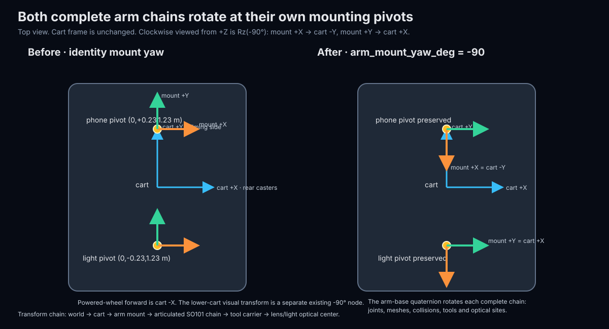
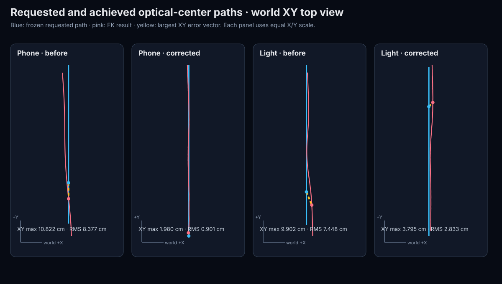

# Arm mounting, IK and coordinated-base correction — 12 September 2026

The corrected default shot is mathematically accepted by the declared model corridors and preserved in [`data/real-robot-review-mobile-ik-run-local-20260912.json`](../data/real-robot-review-mobile-ik-run-local-20260912.json). Its full identity is `85172f6099834beb90f453fcba09c391ffd56392f1411c2e80a5c5795f339fdb`. This artifact has the same settings, arm curve, samples, wheel packets, target programs and numerical results as the earlier final candidate. Its new identity binds the run-local cart-start convention. This is a software result. The physical preflight rejects live execution because the required real response, alignment, timing, loaded-limit and scene evidence is incomplete.

## Established causes

The saved failing shot was reproduced before the correction. Its phone maximum position error was 10.822 cm and its light maximum was 10.232 cm. Re-evaluating the saved 40 ms frames gives phone RMS 8.377 cm and light RMS 7.839 cm. The worst phone error at shot time 2.12 s was almost entirely world Y: requested `[-1.220000, 0.118531, 1.503038]` m, achieved `[-1.219358, 0.010308, 1.503035]` m, error `[+0.000642, -0.108223, -0.000002]` m.

The old result was not evidence that this shot was physically unreachable. Its joints retained 2.29° of model-limit margin while aim was 0.024° and roll was 0.766°. The optimizer had traded optical-center position for orientation. The model also omitted the requested arm mounting yaw, and candidate cart poses were allowed to regenerate cart-relative desired positions. Those target and frame errors made a cart search incapable of preserving the authored world shot.

The causes were separated as follows:

- The complete phone and light chains now use explicit `Rz(-90°)` transforms at their individual mounts. Their translations remain `(0,+0.23,1.23)` m and `(0,-0.23,1.23)` m in the cart frame. The existing `lower_cart` -90° node remains separate and is not composed twice.
- The 321-point authored phone and light paths are materialized once against the reference cart path as immutable world-space programs. Candidate base motion cannot move these targets.
- The arm solver uses calibrated/model joint ranges as hard bounds, measures position, pointing and true optical roll separately, and uses deterministic alternate seeds. The former 0.04 rad limit inset is a posture preference in the standalone solver. The coordinated solver declares a 0.018 rad keyframe planning margin; interpolation is then screened against the real model limit.
- A 17-keyframe fixed-cart ablation with the corrected mount and hierarchical IK reached phone position/aim of 0.692 cm/0.202°, but the phone roll branch was approximately 179° and none of the 17 phone samples met the roll policy. The light reached 4.706 cm and 0.130° aim. This bounded diagnostic shows why the shared cart is useful; it is not an accepted interpolated trajectory.
- The accepted search uses one physical cart for both arms. It optimizes one constant staging change and two continuous wheel speeds, generates only differential-drive motion at the powered axle, converts it to exact two-decimal UART packets, reintegrates those packets, and solves both arms again on that quantized path.
- Interpolation and command conversion were secondary effects. The final phone maximum changes from 1.9804 cm on the dense continuous model samples to 1.9896 cm after integer encoder conversion. The final light changes from 3.9004 cm to 3.9259 cm. Those stages are now acceptance checks rather than assumptions.

The corrected transform chain is:

```text
world → cart → arm mount → articulated SO101 chain → tool carrier → optical center
```

The world origin is the actor/turn-center mark and world +Z is up. Cart +X points toward the passive rear casters, cart +Y toward the filming side, and powered-wheel forward is cart -X. Phone XYZ means the lens optical-center origin expressed in the world frame. The light position likewise refers to its optical site. Optical +Z is forward, +X image-right and +Y image-down.

`Rz(-90°) = [[0,1,0],[-1,0,0],[0,0,1]]`, within floating-point precision. Therefore it maps cart/mount `+X` to `-Y` and `+Y` to `+X`. This sign follows the stated clockwise-from-above convention, independent of the simulator viewing camera and the cart's world yaw.



## Before and after

| Quantity | Saved failing shot | Corrected coordinated shot |
|---|---:|---:|
| Phone position, maximum / RMS | 10.822 / 8.377 cm | 1.980 / 0.905 cm |
| Phone after integer encoder conversion, maximum / RMS | Not previously checked | 1.990 / 0.905 cm |
| Light position, maximum / RMS | 10.232 / 7.839 cm | 3.900 / 2.976 cm |
| Light after integer encoder conversion, maximum / RMS | Not previously checked | 3.926 / 2.989 cm |
| Maximum aim error | 0.024° | 0.996° continuous; 0.979° encoded |
| Maximum phone roll | 0.766° | 1.946° continuous; 1.986° encoded |
| Minimum model joint-limit margin | 2.29° | 0.643° over the complete polynomial |
| Original-shot cart translation | 1.2375 m | 1.2884 m predicted |
| Original-shot cart yaw change | 0° | 1.630° predicted |
| Start staging change from the old cart pose | None | `[-0.1331 m, +0.0794 m, -4.070°]` |

The declared phone policy aims for 1 cm, warns above 1 cm and fails above 2 cm. The result therefore passes with a warning. The light policy aims for 2 cm, warns above 2 cm and fails above 5 cm. The result passes the declared mandatory corridor but does **not** pass the former stricter 2 cm light threshold. No threshold change is presented as an accuracy improvement.

The staging change is part of the planning geometry and is not a surveyed physical coordinate. Live execution defines the cart's actual start as run-local `(0, 0, 0)` wherever it is placed, then transmits the same timed wheel schedule. Relative to that start, the simulator predicts final cart pose `[-1.288308 m, -0.010768 m, +0.028448 rad]`, or about 1.289 m of travel and 1.630° of heading change. The planning-world start `[-1.733051, -0.139379, -1.641834]` remains in the artifact only to preserve the solved arm/cart geometry and convert predicted poses to the run-local frame.



The path figure shows top-view XY error; the acceptance table uses full XYZ distance. Each panel uses equal X/Y scale. The yellow segment is the largest XY error vector for that panel.

## Validation coverage and remaining assumptions

The optimized spline was checked by FK at 541 finite samples with at most 28.125 ms between samples, including every 40 ms arm dispatch instant. Integer encoder conversion was replayed at all 226 dispatch points in the original shot. Joint position, speed, acceleration and piecewise jerk extrema were evaluated analytically from the polynomial. The prepared transition's nominal swept-geometry screen refined to a 10 ms maximum gap and reports a 27.92 mm conditional lower bound. Finite task-space sampling is not a continuous mathematical proof and none of these results measures physical flex, backlash, cart slip or servo lag.

The continuous and quantized least-squares stages terminated. The final SLSQP margin projection reported a positive-directional-derivative status for the first phone keyframe against its tighter internal planning corridor. Deterministic alternate seeds found no point inside that internal corridor. The resulting public constraints still pass independently in dense FK and encoded-command replay. Numerical termination, task feasibility and hardware readiness remain separate fields in the artifact.

The nominal model's sampled payload demand is 1.607 N·m against the previous assumed 0.800 N·m screen. It is recorded as an unqualified physical-load assumption, not hidden by slowing the trajectory. The retained 1.23 m platform height, 1.80 m maximum extension and 0.34 m horizontal extension do not verify every link, joint axis, payload mass, lens offset or light offset. Original calibrations remain byte-for-byte unchanged; the active phone elbow maximum 3086 and light wrist-flex maximum 3204 remain explicit revisions.

## Physical status

The fresh read-only inspection [`data/arm-inspection-mobile-ik-20260912.json`](../data/arm-inspection-mobile-ik-20260912.json) opened COM9 and COM8, received all expected IDs, sent no register writes or motion commands, and found torque off on all ten motors. It also found:

- Phone shoulder lift raw 3189, above its unchanged configured maximum 3161.
- Light wrist flex raw 3204, at its calibration endpoint and beyond the current simulator's 95° model range.
- Phone bus voltage 12.3–12.5 V and light bus voltage 5.7–5.8 V in this sequential snapshot.

The exact plan preflight returns `live_execution_allowed:false`. It still needs predeclared acceptance criteria, independent left/right cart response, cart stop/watchdog evidence, loaded arm stop/hold limits, scene/stability evidence, measured optical alignment, full three-device host timing, verified model mappings, and measured role-specific velocity/acceleration/jerk/step/tracking limits. The Windows hardware profile remains disabled. A full physical run was not started, so no torque was enabled and the cart did not move.

Verification performed for this correction: Python syntax compilation of the modified production modules, deterministic default compilation, exact plan preparation, canonical plan reconstruction, analytic polynomial checks, FK/task checks, command-count replay, swept nominal geometry screening, and the fresh real read-only arm inspection. Per the operator's instruction, fake-bus unit tests were not run and are not cited as motor evidence.
