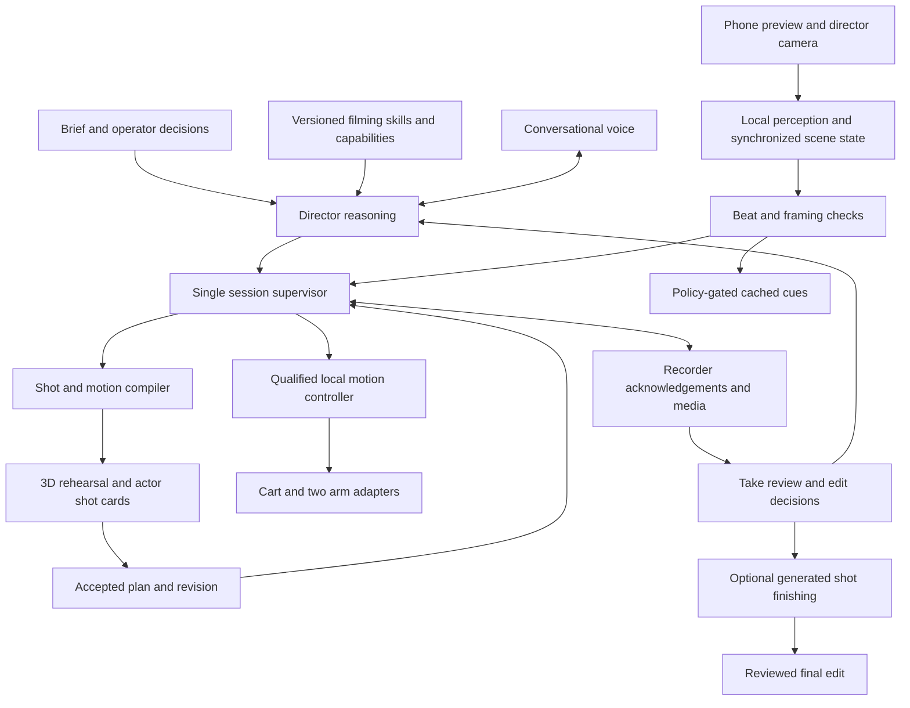

# TakeOne AI Director: product and architecture decision

Date: 2026-09-12. Status: recommended implementation baseline, grounded in the current workspace and official research. This document is a design decision, not a claim that the Director has been implemented or benchmarked. Cart testing, runtime configuration, calibration and hardware are unchanged by this work.

The [AI Director delivery pack](ai-director/README.md) translates the user's accepted direction and subsequent clarifications into ordered implementation prompts and acceptance gates. The current release records quietly and reviews each finalized take; conversational line help belongs in preparation, rehearsal and review.

## Decision

Build TakeOne as a production assistant for people who want to appear and perform in their own films. The Director owns the brief, accepted shot, rehearsal, recording, review and finishing workflow. Its software combines asynchronous AI reasoning with one deterministic session supervisor, local visual measurements, the existing motion compiler and independently timed device execution.

Use a hybrid implementation first: GPT-5.6 Terra for creative planning and selected visual review; GPT-Live 1 with client delegation for conversational setup and retake discussion; local OpenCV/MediaPipe measurements and cached rehearsal cues. Keep model selection explicit. Benchmark Qwen3.5-4B and Gemini Robotics ER 2 against the same task recordings before adding either to the production path. Do not train a general foundation model or learned motor policy for the first release.

Start with one actor, one measured indoor setup, a few observable acting beats and static shots. Add a qualified cart movement through the separate motion release gate. Build a complete usable take before expanding into an arbitrary multi-person microdrama engine.

## Product critique: what would make people choose TakeOne?

The weak proposition is a prompt box, cinematic terminology, a preview and AI effects. Higgsfield already advertises script breakdown, an AI assistant, camera movement controls, reusable production elements and multiple video models. It also teaches edits to real footage. Those capabilities are a competitive baseline, not a TakeOne advantage. These are vendor-described capabilities; no head-to-head quality test was performed here. [Cinema Studio](https://higgsfield.ai/cinematic-video-generator), [real-footage workflow](https://higgsfield.ai/academy/courses/mix-ai-real-footage).

The stronger proposition is: **help a person perform, capture and finish a film they could not easily shoot alone.** The original recording contains their chosen performance, actual product, real interaction and specific place and moment. A synthetic depiction is a different deliverable even when it looks convincing. We should not claim that AI will never reproduce realistic faces, emotion or physics, or that every customer values original capture. Whether customers value this distinction enough to pay is a hypothesis to test.

The defensible assets to develop are reliable capture and retakes, useful restrained coaching, measured rig behavior, production continuity, and a permissioned dataset linking intended shots to actual performances and useful corrections. A collection of prompts or access to a video generator is easy to reproduce. Hardware alone also adds setup, charging, floor-space, mechanical support and service costs; it must produce a visible improvement over a tripod or inexpensive tracking mount.

Initial audience hypothesis: solo creators and small teams making performance-led microdramas, explainers and product scenes in a controlled space. Let software-only rehearsal/coaching work with a stationary camera. Introduce the robot where repeatable movement, framing correction or lighting materially improves the take. Do not make every user solve robot setup to get value.

Test against three alternatives with the same brief: phone/tripod plus conventional editing, a generative-video workflow, and TakeOne. Measure time to an accepted result, creator preference, identity/product/detail preservation, retakes, interruption burden, total cost and willingness to use/pay again. TakeOne should win a defined customer task before trying to beat Higgsfield across its entire product.

## What the project already has

This review covered the root conventions/README, current architecture and movement docs, the latest Director prompt, earlier coordinated-motion design, original Director documentation, current planner/IK/validation/execution/adapters, cart interfaces, simulator API/UI, recording reference configuration and existing evidence. It does not claim semantic review of every upstream LeRobot training file or a fresh hardware qualification.

| Area | Current evidence | Consequence |
|---|---|---|
| Product organization | `packages/takeone`, thin rehearsal app, isolated LeRobot checkout | Keep this layout; another broad migration is unnecessary |
| Rig and movement | Reusable robot geometry, independent five-joint arms, differential-drive prediction, ring/panel/tube variants | Reuse models and solvers; generate scene parameters and targets, not a new robot mesh per prompt |
| Scene/actor model | `planning/targets.py::actor_target` computes a preset height/turn target | General scenes, objects, dialogue and observed actor beats are missing |
| Shot language | `compile_shot` accepts bounded settings and returns a full offline trajectory; actor cues are fixed strings | Natural-language-to-shot translation is not implemented |
| Feasibility | `validation.py` checks aim, camera height and other screens but does not enforce full tool-position residuals | Report achieved versus requested position and accepted changes before treating an AI-planned shot as achieved |
| UI adaptation | Synthetic phase controller exists; active UART playback rejects actor-follow retiming | There is no implemented physical actor-follow controller |
| Camera controls | Exported view contains FOV/beam/intensity values separately from compiled settings | Bring real lens/crop/exposure/light capabilities into accepted shot identity; display knobs are not hardware control |
| Live observations | No production camera/perception/scene packages; reference camera endpoints are null | A live world-state and phone-preview bridge are major missing dependencies |
| Execution | Fake combined executor and bounded cart-only commissioning path | Neither supplies qualified coordinated filming; preserve the 60 ms watchdog boundary |
| Recording and edit | Historical recording configuration, no acknowledged production recorder or finishing provider | A saved plan or a simulated cue is not a captured clip |
| Director | Detailed prompt (historical request, removed from the tree; see git history) | Much of the desired architecture already exists as a specification; the next step is an integrated implementation |

The earlier September 12 architecture review (removed; see git history) recorded a numerical phone/light position-residual finding. This review confirmed the missing acceptance logic in the code; it did not rerun those numerical measurements while cart testing was in progress. Existing calibration, payload, start/stop and loaded-motion blockers remain visible.

## Changes to the proposed workflow

### 1. Skills must produce explicit decisions, not just impressive vocabulary

A cinematography skill should specify when it applies, needed inputs, supported shot primitives, actor beats, framing priorities, lighting intent, continuity rules, limits and examples. Skills are versioned application assets loaded by the runtime; they are not dependent on a Codex session being open. Initially select a small curated set using explicit tags. A vector database is unnecessary for a handful of skills.

Example: a dialogue-reaction skill defines who is speaking, the listener's eyeline, the reaction pause, screen direction, shot size and what must remain visible. Its output should say what the actor does and which measurable evidence would show completion. It should not turn every brief into elaborate camera motion. Stillness can serve the scene better and is easier to capture.

Use one typed production specification as the source for script, shot cards, simulator, actor instructions, execution and edit decisions. The LLM proposes intent and supported primitives. The compiler calculates geometry and returns achieved results, revisions and rejection reasons. The user approves the resulting creative changes. Mathematical validity and human-readable creative acceptance are separate checks.

### 2. The 3D world is a simplified rehearsal with calibrated geometry

Keep the existing rig model. Represent actors, props, marks, surfaces and future effects with simple assets. The room is session-specific: establish floor coordinates and obstacles from a measured setup. Static rig geometry does not make an arbitrary user's room known. An optional generated demo can communicate style; it is not required for robot planning.

Show both the actual shooting-camera view and a simple overhead blocking diagram. A preview with perfect digital acting should not imply the real actor must match every animation frame. Mark infeasible or revised camera moves clearly. Record unsupported actions, such as an unqualified orbit or controllable optical zoom, as unavailable instead of substituting a different move silently.

### 3. Compare measurable intent with observations, not raw real/simulated pixels

The Director needs to know the expected beat and allowable variation. The comparison should use actor position within a mark, direction of travel, head/body orientation, visible prop area, dialogue timing, screen-space framing and relevant camera/recording state.

Use camera calibration and time-aligned transforms to project planned geometry into each camera. OpenCV supplies the relevant projection and calibration tools. A floor-contact observation can be mapped to a known floor plane; a face pixel cannot simply be assigned floor depth. Generic monocular pose estimates do not establish absolute room coordinates. [OpenCV camera geometry](https://docs.opencv.org/4.13.0/d9/d0c/group__calib3d.html).

Preserve two camera authorities: the director camera supplies wider context, and the phone preview supplies the real filming composition. The phone recording remains the original media. If the director camera moves with the cart, its calibrated pose must move too. Without that pose, do not claim a metric comparison in the world frame. Head direction is not exact eye gaze; use sufficiently visible, calibrated evidence or return UNKNOWN.

Align observations to **beat progress**, not only wall-clock seconds. Someone delivering a line slowly is not automatically performing the wrong action. Actor progress, planned motion progress and actual robot progress remain distinct. The current finite UART plan cannot be slowed by stretching its timestamps: the 0.04 deadband and two-decimal commands can invalidate the new speed. A later qualified progress controller must recompute wheel requests and coordinated arm constraints. Until then, use fixed motion windows or stop/replan at a supported boundary.

### 4. Separate observable performance from subjective acting judgement

Local detectors can estimate pose and facial movement. MediaPipe supplies body landmarks, face landmarks and facial blendshape outputs suitable for observable cues; these outputs are not a certificate of emotional truth or artistic quality. [Pose Landmarker](https://developers.google.com/edge/mediapipe/solutions/vision/pose_landmarker), [Face Landmarker](https://developers.google.com/edge/mediapipe/solutions/vision/face_landmarker).

Start with checks such as: reach mark B, face the offscreen partner, wait for the other line, keep the product visible, hold the final pose. Represent each result as SATISFIED, VIOLATED or UNKNOWN with evidence, confidence and expiry. Occlusion or low confidence should not become an accusation that the actor made a mistake.

Offer performance suggestions in rehearsal or review: a longer pause, slower delivery, smaller gesture, an observable requested smile, or an alternative reaction. A human can accept or ignore them. Do not reduce acting to a smile threshold or claim to know someone's internal emotion from their face. The research review on facial movements explains why such inferences are context-dependent. [Barrett and colleagues](https://www.psychologicalscience.org/journals/pspi/1529100619832930/).

### 5. Speaking continuously can spoil the film

Use rehearsal coaching, quiet recording and post-take review. The user's subsequent clarification defers coached recording from the current release. Silence ordinary coaching from recording request through confirmed stop, clear queued speech, and review only after media finalization. Urgent stop/cut behavior remains a separate local operator/control path. An earpiece does not override the quiet-recording policy.

Before a routine cue: require persistent evidence, suppress duplicate corrections, permit one instruction at a time and allow a response window. Begin with the existing documented 0.5-second persistence, roughly 2-second response window and at most two attempts, then tune against observed actor experience. Distinguish robot/framing limitations from actor errors. Within a qualified correction envelope, let the phone arm correct small framing errors before asking the actor to move; the cart should not chase detector jitter.

Keep scripted dialogue separate from operator commands. An actor saying "stop" in a scene must not accidentally execute a control tool. During recording, control authorization comes from the designated operator channel, not arbitrary transcript text. A speech interruption also must not be confused with cancelling physical work.

### 6. Own the edit; use Seedance for explicit generated changes

Save takes, select clips and create a conventional edit with an edit-decision list, clean dialogue and original timing. Apply AI finishing to selected shots with explicit preservation/change instructions, then review the returned media and assemble the final timeline. Store original and generated versions separately. A generated edit can change identity, dialogue, product detail, timing or camera motion despite instructions, so prompts alone are insufficient acceptance checks.

Seedance 2.5's official announcement describes video references, clay-render references and targeted editing. Updated research for the delivery pack found a documented public route: Runway lists `seedance2_5` alongside `aleph2`. Account access and output quality on TakeOne footage remain untested. Reference-conditioned generation must be evaluated separately from precise preservation edits. Keep the core filming product independent of generation. [Seedance announcement](https://seed.bytedance.com/en/blog/one-take-creation-flexible-referencing-introducing-seedance-2-5), [Runway model catalog](https://docs.dev.runwayml.com/guides/models/), [current integration decision](ai-director/provider-decisions.md).

Plan future effects before filming: reserve eyelines and screen space, record useful lead-in/out handles and clean plates when needed, define occlusion and lighting cues, and preserve camera/subject timing. Effects should enrich an already usable take. The product should still deliver an original edit when enhancement is unavailable or rejected.

## Runtime architecture

The supervisor is part of the Director. It owns session state and arbitrates results from specialists. Its reasoning component proposes decisions; it cannot overwrite measurements, bypass limits or turn a tool call into a claim of successful recording. Local protective actions can preempt motion without waiting for cloud approval.

Keep one Python product application with distinct execution contexts for perception, AI/provider jobs and device timing. Use a browser for the user interface, a paired local runtime for cameras/devices, and a small trusted service for provider credentials/jobs where needed. A hosted website alone does not supply reliable serial timing or phone recording control. Keep the current local rehearsal server isolated while the new session API is developed.

Use the existing ports/adapters and strategy patterns, a single-writer session state machine, immutable plan revisions, bounded job queues, cancellation IDs, idempotent recording/job commands and a durable session/event journal. A local SQLite database plus media files is sufficient to begin; there is no demonstrated need for Kafka, a microservice fleet or one agent per subsystem. Avoid a long autonomous reasoning loop during a take. Network/model failure should produce an explicit unavailable state; no automatic provider replacement or stale decision execution.

The Director's tool vocabulary should expose scene/capability inspection, shot planning, preview, rehearsal, cue requests, recording, review, retake, finishing and stop requests. Tool handlers enforce state, accepted revision, permission, deadline and measured prerequisites. Raw serial commands, motor angles, torque and unrestricted shell access are excluded from the AI tool set.

## Model and compute choices

These are starting selections and benchmark candidates, not a measured ranking on TakeOne. Availability, account access and concrete versions must be checked when implementing the provider adapters.

| Job | Initial choice | Why and boundary |
|---|---|---|
| Creative brief and structured shot proposal | GPT-5.6 Terra through Responses | Text/image input and structured output; make few purposeful calls, then use the local compiler |
| Simple extraction/tagging | Deterministic rules first; benchmark GPT-5.6 Luna if needed | Avoid paying for a second planning agent merely to rephrase text |
| Setup and review conversation | GPT-Live 1, client delegation | Voice and backend execution stay separate; all application decisions return through the supervisor |
| Routine rehearsal cues | Cached local recordings or prepared speech | Predictable wording and onset without a provider call |
| Pose, head orientation and basic framing | Local MediaPipe/OpenCV | High-frequency observations and explicit measurable checks |
| Ambiguous visual context or take review | Selected timestamped frames/short clips to an explicit semantic provider | Low-rate or event-triggered; no authority to invent metric state |
| Optional local semantic model | Qwen3.5-4B, benchmark a pinned quantized build | Candidate for lower recurring cost/privacy; not yet measured on this machine |
| Robotics-specific semantic challenger | Gemini Robotics ER 2 / streaming preview | Relevant progress/spatial reasoning; benchmark evidence quality and latency |

Terra and Luna support text/image inputs and structured outputs. Current standard short-context text pricing is respectively $2/$12 and $0.20/$1.20 per million input/output tokens. This is a cost comparison, not proof of equivalent task quality. [Terra model](https://developers.openai.com/api/docs/models/gpt-5.6-terra), [Luna model](https://developers.openai.com/api/docs/models/gpt-5.6-luna).

GPT-Live 1 costs $0.05 per connected session minute, with backend usage separate. It does not accept images itself: visual analysis belongs in the backend. Client delegation lets TakeOne retain its own state, tools and cancellation policy. [GPT-Live model](https://developers.openai.com/api/docs/models/gpt-live-1), [client delegation](https://developers.openai.com/api/docs/guides/live-delegation). GPT-Realtime-2.1 Mini is an alternative to benchmark if a single audio/image/tool session is simpler; its audio token pricing is $10 input/$20 output per million, so it is not directly comparable to session-minute pricing without measuring actual use. [Realtime Mini](https://developers.openai.com/api/docs/models/gpt-realtime-2.1-mini).

Gemini Live is another audio/video conversation option. The standard Live SDK guide describes sending individual video frames at up to 1 fps; that documented path cannot replace local high-rate geometry. Robotics ER 2 Streaming is a separate preview endpoint with audio/video input, text output and no native audio generation. Do not confuse it with a complete speaking robot controller or a VLA trained for this rig. [Live SDK](https://ai.google.dev/gemini-api/docs/live-api/get-started-sdk), [Robotics ER endpoints](https://ai.google.dev/gemini-api/docs/robotics-overview).

The official Qwen3.5-4B release is an open-weight vision-language option labeled Apache 2.0. Local inspection found an Intel Core Ultra 9 185H, about 32 GB RAM and an RTX 4060 Laptop GPU with 8,188 MiB VRAM. This supports evaluating a small quantized model; it does not establish inference speed or sufficient memory under simultaneous video decoding, rendering and tracking. Model weights, vision processing, context cache and runtime buffers all consume memory. Limit context and frame resolution and measure the complete workload. [Qwen model card](https://huggingface.co/Qwen/Qwen3.5-4B).

Do not train from scratch now. Later, collect permissioned examples of intended beats, synchronized observations, coach recommendations, human acceptance and useful outcomes. Train a narrow beat recognizer or correction ranker only if it beats the geometric/rule baseline on held-out actors and setups. Keep any future learned motor policy behind deterministic limits. Owning the workflow and evaluation data can be more valuable than owning a general model.

## Cost and responsiveness targets

Illustrative arithmetic, not a session quote: one Terra request with 10,000 input and 2,000 billed output tokens costs $0.044. Ten connected GPT-Live minutes cost $0.50. Forty such Terra calls would cost $1.76 before voice, visual/audio inputs, extra reasoning output, provider tools, retries, storage or video generation. Meter these categories independently. Close unused live sessions deliberately, cache accepted plans and phrases, send selected visual evidence rather than every frame, and require a separate finishing budget before submitting generation jobs.

Target local tracking at 30 Hz and geometry/beat evaluation at 10 Hz. Start with p95 capture-to-observation age at most 100 ms, cached cue onset within 150 ms after the persistence gate, and conversational first audio within 1 second of detected end-of-speech. These are proposed acceptance targets, not existing measurements. Report the deliberate 0.5-second persistence delay separately, and measure total observed-event-to-audible-cue latency. Publish p50/p95/p99, sample counts, queue growth and device/transport conditions. Do not add separate p95 values and claim the sum is a measured end-to-end percentile.

The cart's user-reported 60 ms watchdog remains a firmware deadline. Existing cart execution targets 20 ms writes; neither cloud voice nor visual reasoning participates in those writes. This design does not change the cart timing or qualify combined movement.

## Immediate next milestone

Deliver one stationary-camera Director session: brief to typed shot, simple rehearsal, actual observation of one selected actor, one useful correction, acknowledged recording, saved clip, evidence-based review and a playable original edit. It must distinguish success, uncertainty and failure without an operator manually relaying state between components.

Use the [implementation and evaluation plan](ai-director-build-plan-2026-09-12.md) as the next coding specification. Move to robot corrections only after their independent physical gates pass. Keep the existing Director prompt as historical design context; this decision narrows the first deliverable and adds current model/competitive findings.
