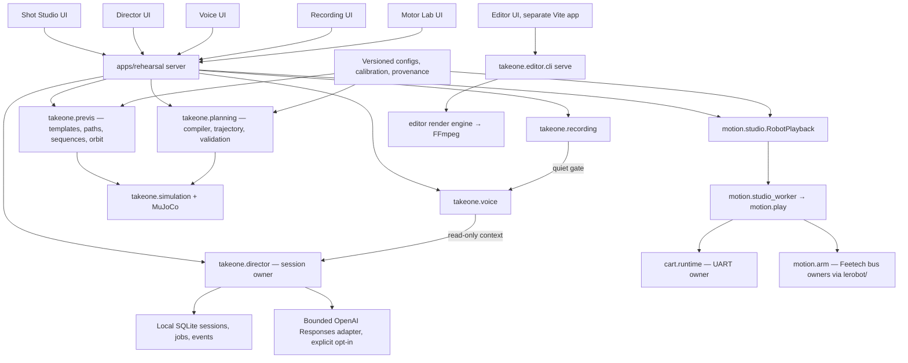

# TakeOne architecture

Product code lives in `packages/takeone`; the rehearsal app under
`apps/rehearsal` is its offline client, and the editor under `apps/editor` is
a separate local client of `takeone.editor`. The independent LeRobot source,
Git database and hardware environment are preserved under `lerobot/`. See
[repository contents](repository-contents.md) for cloning and provenance.

## System map

The app never imports a serial transport. Only the explicit Feature 02 **Run
on robot** action starts a separate device worker; every preview, compile and
preparation action is offline. `dry-run` and the offline `check` commands
validate data and mathematics only — they cannot energize a motor or
establish physical completion.

## The two planning paths

**Previs (`takeone.previs`)** powers the Shot Studio: the movement-template
catalog (28 presets in six families), drawn ground paths, multi-shot Director
sequences, repositioning moves and the original orbit study. It uses
calibrated pointing-first IK and the analytical powered-axle drive model, and
serves browser-ready frame arrays. Previews are cached content-addressed on
disk (`data/previs-cache/`, bounded, keyed by settings + provenance so no
stale result can ever be served). Robot playback for these shots goes through
`previs/start_pose.py` (exact calibration midpoints, stationary-cart aiming)
into a finite `motion.studio_plan`.

**The shot compiler (`takeone.planning`)** is the older, fully validated
pipeline behind `/api/compile`, `/api/robot-plan` and the plan review/preflight
flow. It freezes authored world-target samples, solves shared cart/arm horizon
samples, fits one cubic spline, and validates that spline on an independent
dense grid plus every 40 ms dispatch instant. `planning/curve.py` evaluates the
same coefficients for arm dispatch and preview; `simulation.robot.pose_frame`
owns FK/render serialization. Exported plans are reconstructed canonically and
preflighted before any hardware use.

**Direct joint mode (`takeone.direct`)** bypasses both: raw encoder counts at
calibrated midpoints with one shoulder-pan sweep, no IK, for the Motor Lab and
the exact-values hardware test path (`takeone.motion.direct`).

## Robot geometry and drive model

Canonical geometry is under `assets/robots/takeone/` (three light variants:
ring, panel, tube); preserved validation assets and licenses remain under
`assets/robots/reference/`. Large powered wheels are at the cart's front
(drive +X is cart −X); small passive swivel casters are at the rear. Both arm
mounts are 1.23 m above the floor; original SO-101 chains are unscaled; arm
mount yaws are +90° per the September 13 correction. Chassis x/y/yaw and
casters are derived state from the two actuated wheels. Integration uses the
signed axle offset and exact wire values; it is predicted motion, not measured
odometry (`reverse_enabled: false`, empty wheel-response tables — the
provisional symmetric model cannot establish physical straightness).

## Device ownership and safety

`execution.RobotRunner` (qualified pipeline) reconstructs the complete
artifact and checks measured prerequisites before opening devices. Three
spawned owners share one monotonic epoch and bounded health leases. Each arm
opens the installed Feetech bus directly, checks actual state, captures a
fixed pose, and uses acknowledged Goal → Torque Enable → same Goal writes,
keeping the same bus owner through readiness, motion, settling and terminal
hold. The cart sends nonzero commands only after every role is ready. No
follower `configure()`/`calibrate()` sequence is invoked.

Faults latch cancellation: the cart attempts bounded zero requests; arms use a
single fresh bounded hold request when valid, otherwise retain the last target
and report uncertainty. Owners remain available for supported `release`; there
is no automatic loaded-arm torque-off, reconnect or resume. EOF/supervisor
loss is not a physical-stop claim. See [execution](robot-motion-execution.md).

`cart.runtime.CartRunner` is the single cart timing implementation. The
firmware watchdog brakes after 60 ms without commands; the runner targets
20 ms intervals, detects late writes and records host timing separately from
physical response. Supported live-test envelopes: equal 0.04 commands for at
most four seconds, or 0.05 for at most two seconds, in the configured
direction, with stationary supported arms. No UI, IK, AI or file writes run in
dispatch loops.

The studio playback path (`motion.studio` → `studio_worker` → `motion.play`)
stores a finite plan, requires an authenticated Run request and a browser
lease, uses a shared clock and external Stop, and retains terminal arm goals.
Arm aiming/tracking error is recorded but does not gate studio playback.

Calibration originals under `calibration/originals/` are byte-preserved.
Measured, assumed, simulated and transmitted values remain distinguishable
everywhere; `configs/motion-evidence.json` indexes capability-specific
measurements, and exact-plan preflight does not accept generic qualification
booleans as evidence.

## Director, voice, recording, editor

The Director (`takeone.director`) is one state owner accepting scoped,
expiring, idempotent commands, committing session/event/job changes atomically
to SQLite. Creative planning runs as a bounded background worker against an
explicit OpenAI Responses adapter (`configs/director-planning.json`; disabled
without credentials and explicit enablement). Editing a script invalidates its
approval and dependent references. There is no Director-to-motor bridge:
provider jobs never enter a device clock loop or expose motor tools.

Voice (`takeone.voice`) is an offline text rehearsal with an explicit live
provider boundary (disabled by default) and a recorder quiet gate. Recording
(`takeone.recording`) owns offline sessions and simulated takes with validated
synthetic media (FFmpeg), reload recovery and failure states; real camera,
microphone and provider integration remain future packages. Implementation
records live under [ai-director/implementation/](ai-director/implementation/);
the numbered prompts under `ai-director/prompts/` specify the remaining
packages.

The editor (`packages/takeone/editor` + `apps/editor`) is an operation-log
video editor: one reducer, a derived content-addressed edit graph, a
planner/compiler/executor render engine over FFmpeg with an artifact cache,
and OTIO/native export. It is documented in [editor/](editor/README.md) and
mounts on its own local server (`takeone.editor.cli serve`), linked from every
rehearsal surface through the shared shell.

## Browser simulator

The Shot Studio and Motor Lab render with Three.js (vendored, served at
`/vendor/`), plain ES modules, no bundler — `apps/rehearsal/dist` is authored
source. Both pages draw on demand through `render-loop.js`: paused, offscreen
or hidden views schedule no frames, playback and control damping schedule
continuous frames, and per-frame code paths avoid allocation (see
`robot-model.js`). Preview quality defaults to Smooth (DPR ≤ 1, no shadows);
Detailed (DPR ≤ 1.5, shadows) is opt-in. The robot-model payload
(`/api/model`, megabytes of exact mesh JSON) carries an ETag so reloads
revalidate instead of re-downloading, and the Motor Lab rebuilds GPU geometry
only when the model hash actually changes. Mesh vertices are exported
byte-faithfully from compiled MuJoCo coordinates — display convenience never
rounds them.

## Remaining engineering qualification

The real route and measurement importer are implemented; the robot has not
passed physical acceptance. Loaded limits, independent cart response and
stopping, tool/scene measurements, model alignment and full-robot timing
remain unqualified — see [the parameter inventory](calibration-inventory.md).
Physical preflight fails until those measurements exist. Tape/heading
observations support endpoint assessment; repeatability needs separate
supervised trials. Future localization, real recording and learned shot
proposals must feed these same explicit contracts and gates — no Director, AI
or detector writes directly to motors.
