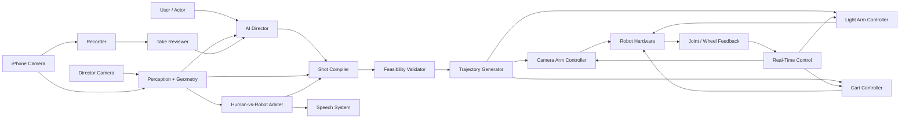
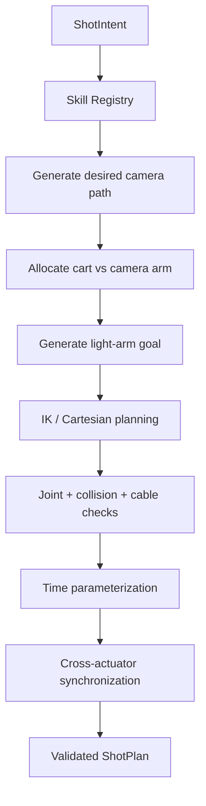
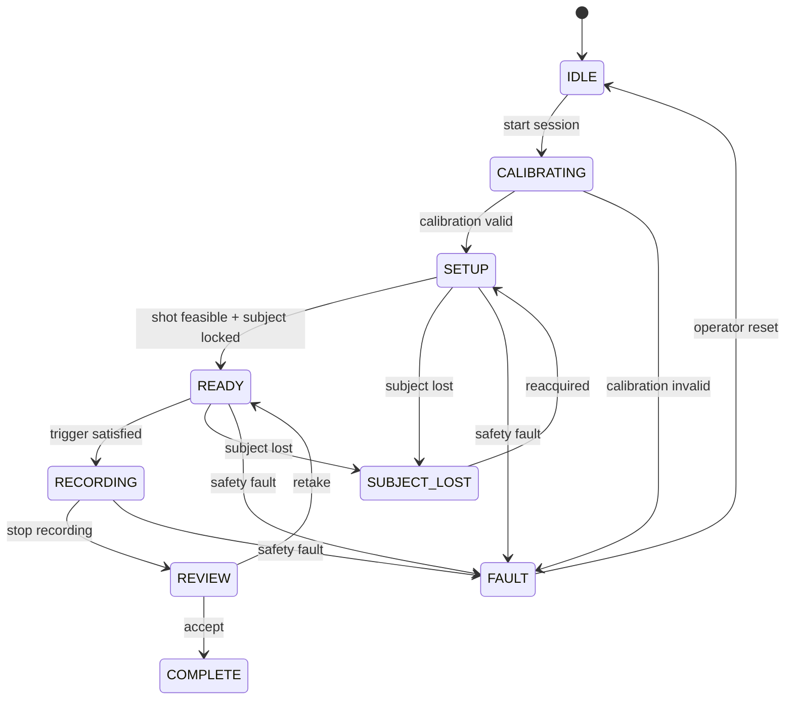

# Hack the North — Autonomous AI Cinematography Robot
## Final System Design & Implementation Documentation

**Status:** implementation-ready architecture  
**Scope:** two robotic arms + mobile cart + iPhone camera + cart-mounted director camera + lighting + AI director  
**Primary design principle:** the AI decides cinematic intent; deterministic robotics and control software owns physical execution.

---

# 1. Executive Summary

This project is an **embodied AI film director and camera crew**.

A user can describe a scene, a short video, or a cinematic intention. The system interprets that request, plans a feasible shot, positions and moves an iPhone camera with one robotic arm, coordinates a second arm for lighting, moves the cart when the shot requires more travel than the camera arm can provide, observes the scene through a dedicated cart-mounted director camera, records the actual shot through the iPhone, reviews the take, and can request another take.

The system is intentionally **not** designed as an LLM wrapper that sends unvalidated natural-language commands directly to motors.

The architecture is split into five responsibilities:

1. **AI Director** — understands creative intent and proposes shot goals.
2. **Perception & Geometry** — understands the subject, objects, floor geometry, framing, pose, gaze, and the relationship between both cameras.
3. **Shot Compiler / Motion Planner** — turns cinematic skills such as `push_in`, `orbit`, or `side_track` into validated camera, cart, and lighting trajectories.
4. **Real-Time Control** — executes trajectories, enforces limits, closes short feedback loops, and stops safely.
5. **Review & Interaction** — evaluates takes, silently self-corrects when the robot can fix a problem, and speaks to the human only when human action is actually required.

The central implementation decision is:

> **Do not train a robot policy just to make the arms move.**
>
> First implement calibrated geometry, forward/inverse kinematics, parameterized cinematography skills, smooth trajectory generation, collision/joint-limit validation, and bounded visual feedback. Use learned models for perception and semantic understanding. Train a movement policy only later if a measured weakness remains.

---

# 2. Product Vision

## 2.1 What the user experiences

A user says something such as:

> “As I realize what happened, slowly move closer, keep my face framed, and let the light reveal me.”

The system should not translate this directly into servo values.

Instead it should create a structured shot intent:

```json
{
  "camera_skill": "push_in",
  "subject_id": "actor_1",
  "travel_m": 0.20,
  "duration_s": 4.0,
  "framing": {
    "preset": "head_and_shoulders",
    "subject_x_norm": 0.50
  },
  "lighting_skill": "shadow_to_reveal",
  "start_condition": "actor_looks_up"
}
```

That request is compiled into a feasible physical plan only after the system checks the actual robot, current scene, joint limits, workspace, cart geometry, shared-arm constraints, and safety rules.

The result is a complete pipeline:

```text
Human intent
    ↓
AI Director
    ↓
Structured ShotIntent
    ↓
Capability + Feasibility Check
    ↓
Camera/Lighting/Cart Shot Compiler
    ↓
Validated ShotPlan
    ↓
Trajectory Generation
    ↓
Real-Time Execution
    ↓
Phone video + telemetry
    ↓
Take Review
    ↓
Accept / retry / modify
```

---

# 3. Core Architectural Rules

## Rule 1 — Creative reasoning and motor execution are separate

The AI director is allowed to say **what** it wants:

- push in
- pull out
- orbit
- follow
- keep the actor on the left third
- reveal the face with light
- begin when the actor looks up

The director is **not** allowed to send raw joint angles, wheel RPM, arbitrary motor commands, or unchecked poses.

Only the motion stack can create executable robot commands.

---

## Rule 2 — The phone camera and director camera have different authority

The project needs both cameras.

### Cart-mounted director camera

Used for:

- room context
- person localization
- floor position
- pose and facing direction
- hand/product occlusion
- subject identity tracking
- global scene understanding
- approximate metric position
- tracking the robot inside the scene
- deciding when the human must move

It is the **director's global eyes and geometric reference**.

### iPhone camera

Used for:

- recorded video
- final composition
- exact framing
- headroom
- subject screen position
- camera exposure/focus/zoom state
- judging whether the captured image is actually correct

It is the **frame of record**.

A person can appear centered in the wide director camera and still be badly framed in the phone camera. Therefore final composition decisions must be evaluated in the phone frame.

---

## Rule 3 — The robot should fix what it can before speaking

The system should not constantly command the actor.

If the subject is slightly off-center and the camera arm can correct it within the current shot constraints, the robot adjusts silently.

The system speaks only when the correction requires human action or when the robot cannot safely solve it itself.

| Situation | Action |
|---|---|
| Subject slightly off-center and arm can compensate | Move arm silently |
| Correction requires unreachable camera pose | Ask actor to move |
| Product is covered by a hand | Ask human |
| Product label faces away | Ask human |
| Presenter gaze is incorrect | Ask human |
| Exposure/focus/white balance issue | Fix silently |
| Subject lost entirely | Stop correction loop and ask subject to return to mark |
| Requested shot violates safety/workspace | Reject or re-plan before recording |

---

## Rule 4 — No silent fallbacks

The system must never quietly switch to an unrelated behavior because a module failed.

Allowed degraded behaviors must be:

- explicit
- typed
- logged
- confidence-scored
- bounded by policy

Example:

```text
SubjectGroundEstimate:
    source = ANKLE_RAY_FLOOR
    confidence = 0.94
```

If ankles are unavailable:

```text
SubjectGroundEstimate:
    source = HEAD_HEIGHT_PRIOR
    confidence = 0.61
    degraded = true
```

The planner may decide that a low-confidence estimate is acceptable for a spoken setup cue but **not** acceptable for autonomous cart motion.

If policy does not allow the degraded estimate, the operation stops.

---

## Rule 5 — Fail closed at physical boundaries

If the system cannot prove a motion is inside its operating envelope, it does not execute it.

Examples:

- IK does not converge
- only part of the Cartesian path is reachable
- collision margin is too small
- cart route is invalid
- phone cable is near its twist limit
- light arm intersects the camera arm envelope
- director loses the locked subject
- motor feedback is stale
- emergency-stop state is active

The planner returns a structured reason to the director instead.

---

# 4. System Context



---

# 5. Responsibility Boundaries

## 5.1 AI Director

The director handles high-level decisions:

- interpret user intent
- choose cinematic movement
- choose framing
- choose duration and pacing
- choose lighting behavior
- choose start trigger
- decide whether a take is good enough
- request an alternate plan after infeasibility
- provide human-facing direction

The director must be conditioned on a `CapabilityManifest` so it does not request physically impossible shots.

Example:

```json
{
  "camera_skills": ["hold", "push_in", "pull_out", "pan", "tilt", "arc"],
  "cart_motion": ["forward", "reverse", "curved_path"],
  "camera_arm_max_reach_m": 0.55,
  "supports_optical_axis_roll": false,
  "supports_zoom": true,
  "light_skills": ["key_hold", "side_reveal", "follow_subject"]
}
```

---

## 5.2 Shot Compiler

The shot compiler is the **hard boundary** between cinematic language and robotics.

Input:

```text
ShotIntent
```

Output:

```text
Validated ShotPlan
```

Responsibilities:

- validate required parameters
- transform cinematography semantics into target camera poses
- allocate motion between arm and cart
- generate light-arm goals
- compute timing
- invoke IK/path planning
- validate reachability
- validate collision constraints
- validate joint/wheel limits
- validate cable constraints
- return a precise failure reason when infeasible

The compiler is deterministic for the same robot state, scene estimate, shot intent, and configuration.

---

## 5.3 Real-Time Controller

The controller owns:

- setpoint tracking
- bounded visual correction
- motor feedback
- joint/wheel state monitoring
- timing
- emergency stop
- watchdogs
- command freshness
- stopping on violations

The LLM never sits in this loop.

---

# 6. Cinematography Skill Library

Every cinematography term is implemented once as a **parameterized geometric skill**.

The director chooses the skill and its parameters; the skill generates the desired camera path.

| 中文 | Skill | Geometric meaning | Likely execution |
|---|---|---|---|
| 推镜 | `push_in` | Move camera toward subject | arm for short move; cart + arm for longer move |
| 拉镜 | `pull_out` | Move camera away from subject | reverse path |
| 横移 | `truck` / `slide` | Translate laterally relative to view | arm for short slide; cart pre-aligned for longer move |
| 升镜 | `pedestal_up` | Increase camera height | coordinated arm joints |
| 降镜 | `pedestal_down` | Decrease camera height | coordinated arm joints |
| 环绕 | `orbit` / `arc` | Move around subject on an arc while maintaining composition | cart provides travel; arm maintains framing/orientation |
| 跟拍 | `tracking` | Maintain camera relationship to moving subject | live subject estimate + cart/arm control |
| 前导 | `lead` | Stay ahead of subject, camera looks back | cart path + camera arm look-at |
| 后跟 | `follow` | Maintain offset behind subject | cart follows subject trajectory |
| 侧跟 | `side_track` | Maintain lateral offset beside subject | cart travels parallel; camera points at subject |
| 摇镜 | `pan` | Rotate viewing direction horizontally around desired optical pivot | arm orientation change |
| 俯仰 | `tilt` | Rotate viewing direction vertically around desired optical pivot | arm orientation change |
| Roll | `roll` | Rotate about optical axis | only if kinematics/mount permit |
| Zoom | `zoom` | Change field of view without translating camera | command iPhone camera application |

These are **capabilities to validate**, not assumptions that every physical rig can perform every move.

---

# 7. Common Skill Interface

All movement skills should implement one interface:

```python
class CameraSkill(Protocol):
    name: str

    def validate(self, ctx: PlanningContext, request: ShotIntent) -> None:
        ...

    def build_camera_path(
        self,
        ctx: PlanningContext,
        request: ShotIntent,
    ) -> CameraPosePath:
        ...
```

The skill returns a camera-space path. It does **not** directly command joints.

This separation is important because the same `push_in` may be executed:

- entirely by the camera arm
- by cart translation plus arm stabilization
- by cart translation plus camera reorientation
- or rejected if no safe solution exists

---

# 8. Movement Geometry

## 8.1 Coordinate frames

Define explicit transforms.

```text
W  = world / calibrated floor frame
C  = cart base frame
D  = director camera optical frame
A  = camera arm base frame
E  = camera arm end-effector frame
P  = iPhone optical frame
L  = light end-effector frame
S  = subject frame
```

Key transforms:

```text
T_W_C
T_C_D
T_C_A
T_A_E(q)
T_E_P
```

Then:

```text
T_C_P = T_C_A · FK(q) · T_E_P
T_W_P = T_W_C · T_C_P
```

Plan around the **iPhone optical frame**, not around a convenient wrist joint.

The phone lens is offset from the wrist; rotating a wrist joint can translate the optical center through an arc.

---

## 8.2 Push in

Given:

- camera pose `P0`
- subject point `S`
- travel `d`
- duration `T`

Direction toward subject:

```text
u = normalize(S - P0.position)
```

Endpoint:

```text
P1.position = P0.position + d * u
```

Orientation is generated from a look-at/framing constraint rather than being left constant blindly.

The path is time-parameterized with velocity, acceleration, and jerk limits.

---

## 8.3 Pull out

Same geometry as push-in with negative travel along the subject direction.

The director may simultaneously change composition, so it is not necessarily the exact reverse of the prior trajectory.

---

## 8.4 Truck / slide

Define camera-right vector from current optical orientation:

```text
r = camera_right(T_W_P)
```

Desired lateral path:

```text
p(t) = p0 + s(t) * d * r
```

For long lateral travel, a non-holonomic cart cannot simply strafe. The system must either:

- pre-align the cart to travel along the required direction
- use a curved route and compensate with the arm
- or reject the request

---

## 8.5 Pedestal

World vertical axis:

```text
z_W = [0, 0, 1]
```

Desired camera position:

```text
p(t) = p0 + s(t) * h * z_W
```

This is limited by arm reach and does not imply crane-scale motion.

---

## 8.6 Orbit / arc

Given:

- subject center `S`
- radius `r`
- starting angle `theta0`
- angular travel `Δtheta`
- camera height `h`

```text
p(theta) = [
    Sx + r*cos(theta),
    Sy + r*sin(theta),
    h
]
```

At every point, the desired camera orientation is derived from a look-at or framing objective.

The planner may split the motion:

```text
cart: supplies large translational arc
arm: supplies residual translation + orientation + composition correction
```

---

## 8.7 Follow

Maintain a desired subject-relative transform:

```text
T_W_P_desired(t) = T_W_S(t) · T_S_P_target
```

The subject estimate updates continuously, but corrections must be low-pass filtered and bounded so tracking noise does not become visible camera shake.

---

## 8.8 Lead

Maintain an offset ahead of the direction of travel:

```text
p_camera = p_subject + d_forward * heading_subject
```

The camera looks back toward the subject.

This requires the cart route to be known or safe enough for reverse/forward movement.

---

## 8.9 Side tracking

Maintain a lateral subject-relative offset:

```text
p_camera = p_subject + d_side * right_subject
```

The cart follows approximately parallel to subject motion while the arm maintains framing.

---

## 8.10 Pan and tilt

The desired effect is an **optical rotation around the intended camera center**, not "move joint 5 by 20 degrees."

The planner computes end-effector poses that preserve the intended optical-center behavior as closely as the kinematics permit.

---

## 8.11 Roll

Rotate around the iPhone optical `z` axis.

Execute only if:

- arm orientation is reachable
- mount supports it
- cable state is safe
- the path stays collision-free

Otherwise return `UNSUPPORTED_ORIENTATION`.

---

## 8.12 Zoom

Zoom is a camera capability, not an arm motion.

The iPhone camera application owns commands such as:

```text
set_zoom(factor, duration)
set_focus(point)
set_exposure_bias(value)
lock_white_balance()
start_recording()
stop_recording()
```

The exact behavior can vary by device and capture configuration.

---

# 9. Planning Pipeline



## 9.1 Motion allocation

The camera objective should not know which actuator supplies each metre of motion.

A `MotionAllocator` decides:

```text
short translation → camera arm
long translation → cart + arm
orientation-only → camera arm
large orbit → cart dominant
framing residual → camera arm
```

The allocator is a Strategy implementation chosen from robot configuration.

---

# 10. Feasibility Result

Never return a bare boolean.

```python
@dataclass(frozen=True)
class FeasibilityResult:
    status: Literal[
        "FEASIBLE",
        "UNREACHABLE",
        "COLLISION",
        "JOINT_LIMIT",
        "CABLE_LIMIT",
        "CART_ROUTE_INVALID",
        "LOW_CONFIDENCE_SCENE",
        "UNSUPPORTED_CAPABILITY",
    ]
    detail: str
    achievable_fraction: float
    suggested_adjustment: ShotAdjustment | None
```

Example:

```json
{
  "status": "UNREACHABLE",
  "detail": "camera-arm vertical reach exceeded by 84 mm",
  "achievable_fraction": 0.78,
  "suggested_adjustment": {
    "type": "reduce_pedestal_height",
    "max_height_delta_m": 0.19
  }
}
```

The director can then choose the feasible alternative.

---

# 11. Dual-Camera Perception Architecture

## 11.1 Director camera

Recommended role:

```text
wide FOV
fixed rigid mount
sees subject + floor + robot
global scene reference
```

The conversation proposes a UVC webcam roughly in the 90–120° horizontal-FOV range, with locked exposure, white balance, and focus where the hardware allows it.

Mount it on a rigid cart post rather than the vibrating arm plate.

---

## 11.2 Phone camera

The iPhone camera feed or telemetry represents the actual image being captured.

Use it for:

- normalized subject center
- rule-of-thirds target
- headroom
- face size
- product composition
- final exposure/focus state
- take-quality review

---

# 12. Metric Scene Geometry

The director camera should not merely say "move a little."

It should estimate meaningful spatial displacement.

## 12.1 Grounding the subject

From a 2D ankle keypoint `u`:

1. undistort point
2. back-project through director-camera intrinsics `K_D`
3. transform ray into cart/world coordinates
4. intersect ray with calibrated floor plane
5. obtain subject ground point in metres

Return source and confidence.

A visible floor mark or ArUco tag improves reliability and gives the human a natural filming instruction: **"hit your mark."**

---

## 12.2 Live phone pose from robot geometry

```text
T_cart_phone =
    T_cart_armbase
    · FK(q)
    · T_wrist_phone_optical
```

Because joint state is known, the system has a live estimate of the phone's camera pose.

---

## 12.3 Composition solve

Suppose the desired subject horizontal image coordinate is:

```text
x_target = 0.33
```

The corresponding viewing constraint defines a plane through the phone optical center.

Intersect that plane with the floor plane.

This produces a **target line on the floor**: subject positions on that line satisfy the requested screen composition for the given camera pose.

Compare:

```text
actual_subject_ground_point
vs.
closest_point_on_target_line
```

The resulting displacement vector is metric.

---

## 12.4 Human-centric direction

Do not say ambiguous "left."

Convert corrections into the actor's frame when possible.

Use shoulder orientation / pose to distinguish:

```text
"your left"
"your right"
"camera left"
"camera right"
```

This prevents the classic mirrored-direction failure.

---

# 13. Perception Rate Tiers

Do not run every model at the same frequency.

## Tier A — Reflex, ~30 Hz

Prefer deterministic/lightweight operations:

- subject tracker update
- phone framing error
- floor projection
- exposure histogram
- hardware state
- stale-signal detection

No VLM call.

---

## Tier B — Pose and geometry, ~10 Hz

Proposed inputs include:

- body pose
- shoulders
- ankles
- wrists
- face/head pose
- hand occlusion
- gaze approximation

The conversation proposes MediaPipe Pose / Face Mesh as hackathon-friendly candidates.

---

## Tier C — Object acquisition

Use an open-vocabulary detector to initialize a product/object track from the brief:

```text
"the blue bottle"
"the red box"
"the laptop"
```

The conversation proposes YOLO-World or OWLv2 for this role.

After detection, hand the object to a cheaper tracker rather than re-running expensive detection every frame.

---

## Tier D — Semantic scene reasoning, ~0.2 Hz

A VLM can inspect occasional keyframes for problems such as:

- blown-out window
- awkward background
- human waiting for a cue
- label facing away
- unexpected scene changes

This loop is intentionally off the real-time motor path.

---

# 14. Subject Locking

At session start, assign one subject identity.

Possible acquisition policies:

- nearest person to calibrated mark
- explicitly selected person
- largest valid pose in setup zone

Once selected:

```text
lock(subject_track_id)
```

Do not jump to another person because somebody walks behind the actor.

If the locked track is lost:

```text
state = SUBJECT_LOST
stop autonomous corrective motion
speak reset instruction
require reacquisition
```

This is essential in a crowded hackathon environment.

---

# 15. Robot-vs-Human Arbitration

```python
def resolve_violation(v: Violation, ctx: RuntimeContext) -> Resolution:
    if v.requires_human_action:
        return Resolution.speak(v)

    correction = ctx.compiler.try_compile_correction(v)

    if correction.is_feasible:
        return Resolution.execute_silently(correction.plan)

    return Resolution.speak(
        v.to_human_instruction(correction.failure)
    )
```

The key behavior is:

> **Arm first. Speech second.**

This makes the system look capable rather than needy.

---

# 16. Spoken Director Architecture

Routine corrections should not require a network model round trip.

## 16.1 Phrase bank

Prepare variations before the demo.

Example categories:

```text
step_lateral × {touch, small, full, big}
step_depth × {touch, small, full}
hit_mark
headroom_high
occlusion_hand
product_face
gaze
hold_still
ready_cue
cut
lost_subject
```

Magnitude mapping proposed in the conversation:

```text
< 0.15 m       → "a touch"
0.15–0.40 m    → "a small step"
0.40–0.80 m    → "a step"
> 0.80 m        → re-plan/reposition rather than repeatedly moving the actor
```

The LLM can still:

- prepare natural phrase variants
- explain novel setups
- give non-time-critical creative direction

But cached runtime phrases keep routine interaction deterministic and low latency.

---

# 17. Correction Gate

Without gating, the director will oscillate and annoy the actor.

The runtime gate should enforce:

```text
1. Persistence
   A violation must remain for ~0.5 s before action.

2. Hysteresis / deadband
   Trigger and clear thresholds differ.

3. Arbitration
   Robot silently corrects when feasible.

4. Exclusivity
   Only one human instruction may be active.

5. Human response window
   After speaking, pause corrective evaluation for ~2 s.

6. Convergence limit
   Maximum two corrections for the same setup.
   Then accept, re-plan, or reset.

7. Recording state gate
   No spoken routine corrections while recording.
```

This stateful behavior belongs in deterministic control logic, not in the LLM prompt.

---

# 18. Session State Machine

Use an explicit state machine.



State transitions must be auditable.

---

# 19. Real-Time Control Layers

## Layer 1 — High-level director

Time scale: seconds.

Responsibilities:

- creative decisions
- shot choice
- re-planning
- review
- novel language

---

## Layer 2 — Shot execution supervisor

Time scale: tens to hundreds of milliseconds.

Responsibilities:

- execute validated plan
- monitor progress
- handle bounded correction
- synchronize camera arm, light arm, cart, and recording
- stop on fault

---

## Layer 3 — Device control

Time scale: hardware-specific high-rate loop.

Responsibilities:

- joint/wheel setpoints
- feedback
- position/velocity control
- hardware watchdogs

No LLM.

---

# 20. Trajectory Generation

The cinematic path defines where the camera should be.

The trajectory generator decides **how fast** it moves.

Constraints:

```text
max velocity
max acceleration
max jerk
per-joint limits
cart acceleration
settling time
shot duration
synchronization constraints
```

A trajectory library such as Ruckig can be used for jerk-limited time parameterization.

Smooth motion is not equivalent to safe motion; collision and geometric validation must happen separately.

---

# 21. Coordinating Camera Arm, Light Arm, and Cart

The system has three physical movers:

```text
camera arm
light arm
mobile cart
```

They cannot be planned independently.

## 21.1 Shared plan

```python
@dataclass(frozen=True)
class ShotPlan:
    camera_trajectory: JointTrajectory
    light_trajectory: JointTrajectory
    cart_trajectory: CartTrajectory
    recording_cues: tuple[RecordingCue, ...]
    safety_envelope: SafetyEnvelope
    expected_duration_s: float
    provenance: PlanProvenance
```

A shot becomes executable only after cross-device validation.

---

## 21.2 Collision coordination

Check at sampled trajectory times:

```text
camera arm ↔ light arm
camera arm ↔ cart structure
light arm ↔ cart structure
both arms ↔ subject safety zone
phone ↔ light / mounts
```

For a hackathon, conservative geometric primitives are preferable to overly complex but unvalidated collision geometry.

---

# 22. Lighting Skills

Lighting should use the same skill philosophy as camera movement.

Start with a small reliable library.

Examples:

```text
key_hold
key_left
key_right
shadow_to_reveal
follow_subject
light_static
```

Each returns desired light poses over time.

Do not let a creative model directly improvise raw light-arm joint trajectories.

---

# 23. Director Tool API

Recommended high-level tools:

```text
inspect_scene()
plan_shot(requirements)
preview_shot(plan_id)
execute_shot(plan_id)
review_take(take_id)
request_replacement(take_id, correction)
```

## `inspect_scene`

Returns structured observations, not raw prose only.

```json
{
  "subject": {
    "id": "actor_1",
    "locked": true,
    "ground_xy_m": [1.62, -0.38],
    "confidence": 0.93
  },
  "phone_frame": {
    "subject_x_norm": 0.47,
    "headroom_norm": 0.11
  },
  "product": {
    "visible": true,
    "occluded_fraction": 0.08
  }
}
```

## `plan_shot`

Never executes.

Returns:

```text
plan_id
feasibility
predicted duration
required human setup
warnings
```

## `execute_shot`

Accepts a valid `plan_id`, checks freshness, then executes.

The director cannot bypass validation by passing ad hoc motion fields into `execute_shot`.

---

# 24. Domain Model

Core types:

```text
ShotIntent
ShotPlan
CameraPose
CameraPosePath
FramingTarget
LightingIntent
SceneSnapshot
SubjectEstimate
ObjectTrack
Violation
Correction
FeasibilityResult
SafetyEnvelope
CapabilityManifest
JointState
CartState
TakeResult
```

Use immutable/frozen planning objects when possible.

Keep units explicit in names:

```text
distance_m
duration_s
angle_rad
velocity_rad_s
position_xy_m
```

Never rely on implicit centimetres/degrees.

---

# 25. Recommended Project Architecture

```text
cinebot/
├── README.md
├── pyproject.toml
├── configs/
│   ├── robot.yaml
│   ├── cameras.yaml
│   ├── limits.yaml
│   ├── skills.yaml
│   └── demo.yaml
│
├── src/cinebot/
│   ├── domain/
│   │   ├── shot.py
│   │   ├── pose.py
│   │   ├── scene.py
│   │   ├── trajectory.py
│   │   ├── capability.py
│   │   ├── safety.py
│   │   └── errors.py
│   │
│   ├── director/
│   │   ├── agent.py
│   │   ├── tools.py
│   │   ├── capability_context.py
│   │   └── review.py
│   │
│   ├── cinematography/
│   │   ├── registry.py
│   │   ├── base.py
│   │   ├── hold.py
│   │   ├── push_in.py
│   │   ├── pull_out.py
│   │   ├── truck.py
│   │   ├── pedestal.py
│   │   ├── orbit.py
│   │   ├── tracking.py
│   │   ├── lead.py
│   │   ├── follow.py
│   │   ├── side_track.py
│   │   ├── pan.py
│   │   ├── tilt.py
│   │   ├── roll.py
│   │   └── zoom.py
│   │
│   ├── planning/
│   │   ├── compiler.py
│   │   ├── allocator.py
│   │   ├── ik.py
│   │   ├── cart_path.py
│   │   ├── collision.py
│   │   ├── cable.py
│   │   ├── feasibility.py
│   │   ├── time_parameterization.py
│   │   └── synchronizer.py
│   │
│   ├── perception/
│   │   ├── director_cam/
│   │   │   ├── calib.py
│   │   │   ├── ground.py
│   │   │   ├── subject.py
│   │   │   ├── pose.py
│   │   │   ├── openvocab.py
│   │   │   ├── self_occlusion.py
│   │   │   └── framing_solve.py
│   │   ├── phone_cam/
│   │   │   ├── frame_state.py
│   │   │   ├── composition.py
│   │   │   └── stream.py
│   │   ├── fusion.py
│   │   └── scene_snapshot.py
│   │
│   ├── control/
│   │   ├── supervisor.py
│   │   ├── correction.py
│   │   ├── watchdog.py
│   │   ├── state_machine.py
│   │   └── execution_clock.py
│   │
│   ├── lighting/
│   │   ├── registry.py
│   │   ├── base.py
│   │   └── skills/
│   │       ├── key_hold.py
│   │       ├── side_reveal.py
│   │       └── follow_subject.py
│   │
│   ├── speech/
│   │   ├── arbiter.py
│   │   ├── gate.py
│   │   └── phrasebank/
│   │       ├── manifest.yaml
│   │       ├── generate.py
│   │       └── select.py
│   │
│   ├── ports/
│   │   ├── arm.py
│   │   ├── cart.py
│   │   ├── camera.py
│   │   ├── scene_perception.py
│   │   ├── speech.py
│   │   └── clock.py
│   │
│   ├── adapters/
│   │   ├── camera_arm/
│   │   │   └── <actual_arm_driver>.py
│   │   ├── light_arm/
│   │   │   └── <actual_arm_driver>.py
│   │   ├── cart/
│   │   │   └── <actual_cart_driver>.py
│   │   ├── iphone/
│   │   │   └── bridge.py
│   │   └── director_camera/
│   │       └── uvc.py
│   │
│   ├── telemetry/
│   │   ├── event.py
│   │   ├── logger.py
│   │   └── recorder.py
│   │
│   └── ui/
│       └── director_view.py
│
├── tests/
│   ├── unit/
│   ├── property/
│   ├── integration/
│   ├── simulation/
│   ├── hardware_in_loop/
│   └── acceptance/
│
├── scripts/
│   ├── calibrate_director_camera.py
│   ├── calibrate_phone_mount.py
│   ├── calibrate_floor.py
│   ├── verify_joint_limits.py
│   ├── run_simulation.py
│   └── run_demo.py
│
└── docs/
    ├── architecture.md
    ├── calibration.md
    ├── cinematography-skills.md
    ├── safety.md
    ├── testing.md
    └── demo-runbook.md
```

The actual arm models should be supplied through configuration and adapter implementations. Do not hard-code guessed arm geometry into cinematography skills.

---

# 26. Design Patterns

Use patterns only where they create a real boundary.

## Ports and Adapters / Hexagonal Architecture

Domain and planning logic depend on interfaces, not vendor SDKs.

```text
planning → ArmPort
planning ↛ VendorArmSDK
```

This makes simulation and hardware drivers interchangeable without contaminating the shot logic.

---

## Strategy

Use for:

- cinematography skills
- motion allocation policies
- subject-acquisition policy
- light skills

Example:

```text
CameraSkill Strategy
    ├─ PushInSkill
    ├─ OrbitSkill
    └─ SideTrackSkill
```

---

## Command

A validated execution plan is wrapped as an immutable command.

```text
ExecuteShotCommand(plan_id, expected_plan_hash)
```

This prevents accidental mutation between preview and execution.

---

## State

Session state is explicit:

```text
IDLE
CALIBRATING
SETUP
READY
RECORDING
REVIEW
SUBJECT_LOST
FAULT
COMPLETE
```

Behavior is state-gated rather than spread across booleans.

---

## Observer / Event Stream

Telemetry consumers observe events without controlling the robot:

```text
ShotPlanned
ShotStarted
TrajectoryProgress
CorrectionApplied
HumanCueIssued
FaultRaised
TakeCompleted
```

UI, logging, and replay consume these events.

---

## Registry

Use registries for supported camera and light skills.

Unsupported skill names fail immediately.

Do not dynamically import arbitrary unknown implementations.

---

# 27. What Not to Build

Avoid:

- generic fallback functions
- direct LLM-to-motor commands
- giant `if/elif` trees for every shot
- hardcoded joint angles inside cinematic skills
- camera movement logic mixed with vendor serial code
- a single "AI loop" controlling all rates
- re-running a VLM at 30 Hz
- allowing a plan to execute after robot state has changed significantly
- automatically switching subjects
- speaking during recorded takes
- treating `zoom` as arm motion
- assuming the cart can strafe
- assuming a smooth trajectory is collision-free
- claiming all 14 cinematography skills work before hardware validation

---

# 28. Calibration

Calibration is part of the product, not a setup afterthought.

## Required calibrations

1. Director camera intrinsics
2. Director camera pose relative to cart
3. Floor plane
4. Camera-arm base relative to cart
5. Arm kinematics / URDF
6. Wrist-to-iPhone optical transform
7. Light-arm base relative to cart
8. Cart wheel scale / heading behavior
9. Optional floor mark / ArUco reference
10. Joint zero positions and motion limits

Persist calibration with version/hash metadata.

Every plan records which calibration version produced it.

---

# 29. Safety Model

## 29.1 Safety envelope

A plan must include:

- allowed joint ranges
- maximum speed
- maximum acceleration
- maximum cart speed
- minimum subject distance
- minimum arm-arm distance
- allowed correction magnitude
- maximum plan age
- emergency stop behavior

---

## 29.2 Watchdogs

Stop execution on:

```text
stale joint telemetry
stale cart telemetry
lost connection
trajectory deadline overrun
unexpected joint error
subject enters protected zone
emergency stop
controller exception
```

Safety stop should not depend on a cloud API.

---

# 30. Planning Freshness

A plan is valid against a particular state snapshot.

Example:

```python
@dataclass(frozen=True)
class PlanProvenance:
    robot_state_hash: str
    calibration_hash: str
    scene_snapshot_id: str
    capability_hash: str
    created_monotonic_s: float
```

Before execution:

```text
check plan age
check calibration unchanged
check robot sufficiently close to planned start state
check safety state
check subject lock
```

If stale, re-plan.

---

# 31. Director Camera Self-Occlusion

Because the system knows robot joint configurations, it can predict where the arms project into the director-camera image.

Use this to mask expected robot pixels before subject tracking or to lower trust in measurements passing through that region.

This avoids a tracker switching from the actor to a moving arm.

---

# 32. Director Overlay

The most useful judging/debugging UI is the wide director-camera view with:

- locked-subject skeleton
- subject ID
- floor mark
- current subject ground point
- phone optical center
- projected phone camera frustum
- target composition line
- measured framing error in centimetres
- camera-arm state
- cart state
- active shot skill
- active plan ID
- feasibility status
- spoken cue caption
- correction source: `ROBOT` vs `HUMAN`
- recording state
- fault banner

This visually proves that the system has a geometric model rather than merely asking an LLM to describe an image.

---

# 33. Testing Strategy

Testing must proceed from math to hardware.

## 33.1 Unit tests

Test:

- coordinate transforms
- ray-floor intersection
- look-at orientation
- target-line composition solve
- skill input validation
- movement endpoints
- framing-error sign conventions
- actor "your left" conversion
- state transitions
- correction hysteresis
- phrase magnitude classification
- feasibility error mapping

---

## 33.2 Property tests

Useful invariants:

### Push-in

For a stationary subject:

```text
distance(camera(t), subject)
```

should monotonically decrease, subject to configured tolerance.

### Pull-out

Distance should monotonically increase.

### Orbit

```text
|distance(camera(t), subject) - radius| < tolerance
```

### Hold

Desired pose remains constant.

### Pan

Optical-center displacement remains below tolerance if hardware supports the required pivot.

### Safety

No generated point exceeds configured bounds.

---

# 34. Simulation

Simulation should use the **same compiler and domain objects** as hardware.

Only the adapters change.

```text
Real:
    ShotCompiler → ArmPort → ActualArmAdapter

Simulation:
    ShotCompiler → ArmPort → SimulatedArmAdapter
```

The simulator should report:

- trajectory feasibility
- joint values over time
- cart path
- camera pose
- phone frustum
- light-arm pose
- collision margin
- tracking/framing error
- whether any limit is violated

Do not call a simulation successful merely because code executed.

A skill passes simulation when its specified invariants hold.

---

# 35. Hardware-in-the-Loop Tests

Run at low speed first.

For each skill:

1. home / verify start state
2. compile shot
3. preview trajectory
4. execute at reduced speed
5. monitor feedback
6. measure final pose error
7. inspect captured footage
8. raise speed only after passing

Required initial hardware validation should focus on a small set:

```text
hold
push_in
pull_out
pan
tilt
small_arc
light_hold
light_reveal
```

Do not spend hackathon time making every cinematic move production-grade.

---

# 36. Acceptance Tests

## A. Spoken intent → physical take

Given:

```text
"Move in slowly while keeping me centered."
```

Pass if:

- director emits valid structured intent
- compiler finds feasible plan
- robot executes it
- phone records
- subject framing remains within defined tolerance
- no safety constraint is violated

---

## B. Robot self-correction

Place actor slightly off target.

Pass if:

- framing violation persists
- arm correction is feasible
- arm corrects silently
- no speech cue occurs

---

## C. Human correction

Place actor beyond reachable correction envelope.

Pass if:

- compiler rejects robot correction
- metric displacement is computed
- system gives one unambiguous actor-centric instruction
- actor reaches target region
- system confirms correction

---

## D. Subject locking

Have another person cross the scene.

Pass if:

- locked actor identity is maintained
- no direction is given to the passerby

---

## E. Lost subject

Actor leaves director frame.

Pass if:

- autonomous corrective motion stops
- state becomes `SUBJECT_LOST`
- system requests a reset
- reacquisition is explicit

---

# 37. Observability

Every execution should emit structured telemetry.

Example:

```json
{
  "ts_monotonic_s": 18342.812,
  "event": "CorrectionApplied",
  "shot_id": "shot_07",
  "source": "ROBOT",
  "violation": "SUBJECT_X_ERROR",
  "error_before": 0.091,
  "error_after": 0.027,
  "unit": "normalized_frame",
  "plan_id": "plan_07c"
}
```

Store:

- shot intent
- scene snapshot
- feasibility result
- trajectory hash
- calibration hash
- motor feedback
- camera state
- human cues
- faults
- take result

This makes failures reproducible.

---

# 38. Take Review

After recording, the review layer can evaluate:

- framing drift
- excessive camera jerk
- subject visibility
- product visibility
- obvious occlusions
- exposure problems
- requested event timing
- whether the shot completed
- optional semantic critique from VLM

It returns:

```text
ACCEPT
RETAKE_SAME_PLAN
REPLAN
```

A model can provide creative feedback, but basic geometric defects should be measured deterministically whenever possible.

---

# 39. AI / ML Boundary

## Use existing ML where it is strong

- natural-language interpretation
- semantic shot planning
- body pose
- face/head pose
- open-vocabulary object detection
- scene semantics
- take-level visual critique

## Do not initially use learned policies for

- joint-limit enforcement
- collision constraints
- emergency stop
- deterministic camera path generation
- cart safety
- trajectory smoothness
- direct motor control

---

# 40. When Custom Robot Learning Becomes Worthwhile

Only train a movement policy after a clear measured failure.

Example target:

> perform a short approach while maintaining head-and-shoulders composition under small subject motion.

Dataset:

- teleoperated successful takes
- synchronized images
- joint positions
- executed actions
- timestamps
- camera state
- scene variation

Evaluation split should use separate takes/setups rather than random neighboring frames.

Compare against the geometric baseline on:

```text
framing error
usable-take rate
smoothness
recovery from perturbation
generalization
failure rate
```

Keep hard safety outside the learned policy.

A standard action-chunking policy that consumes images and joint states does not automatically understand screenplay language. Language-conditioned robot control would require an architecture and dataset explicitly designed for language/goal input.

---

# 41. Hackathon MVP Scope

The project wins by demonstrating a deep, reliable vertical slice, not by listing 30 incomplete skills.

## Must work

1. user gives creative instruction
2. AI director creates structured shot
3. director camera locks subject and estimates scene
4. phone frame confirms final composition
5. planner validates the motion
6. camera arm executes at least `hold` + `push_in`
7. light arm performs at least one synchronized transition
8. cart is integrated for one meaningful movement or repositioning
9. robot silently corrects reachable framing error
10. robot gives a grounded spoken direction when the human must move
11. iPhone records take
12. take review returns a result
13. director overlay visibly explains what is happening

## Strong stretch

- small orbit/arc
- product open-vocabulary tracking
- retry after failed take
- reference-style cinematography
- automated final assembly/editing pipeline

---

# 42. Suggested Build Order

## Gate 0 — Hardware truth

Verify:

- actual arm interfaces
- encoder/joint feedback
- command mode
- safe speed
- cart controllability
- iPhone bridge
- UVC camera access

No architecture assumption should override hardware truth.

---

## Gate 1 — Kinematics

Pass:

```text
joint state → FK → camera optical pose
desired camera pose → IK → valid joint solution
```

---

## Gate 2 — One camera skill

Implement `push_in`.

Pass:

- geometric path correct
- IK path valid
- smooth timing
- execution matches simulation

---

## Gate 3 — Phone framing

Pass:

- phone stream/telemetry available
- subject composition measured in phone frame

---

## Gate 4 — Director geometry

Pass:

- floor calibrated
- actor grounded in metres
- actor track locked
- phone frustum projected into director view

---

## Gate 5 — Corrective behavior

Pass:

> a deliberately introduced ~30 cm setup error produces the correct robot-vs-human arbitration and a human instruction that an unfamiliar person follows correctly.

---

## Gate 6 — Lighting coordination

Pass:

- camera and light plans synchronize
- arm-arm safety checks pass
- visible lighting transition improves scene

---

## Gate 7 — End-to-end take

Pass:

```text
spoken brief
→ shot intent
→ validated plan
→ setup
→ record
→ movement
→ review
→ accepted take
```

---

# 43. Demo Narrative

A strong demo sequence:

### Beat 1 — "Give me a shot"

A judge provides a simple product or subject and asks for a mood.

The AI director explains the planned shot in one sentence.

### Beat 2 — Show understanding

On the overlay:

- actor skeleton
- product box
- phone frustum
- current composition
- floor mark
- metric offset

### Beat 3 — Robot fixes itself

Move the actor slightly.

The camera arm silently compensates.

### Beat 4 — Force an unreachable correction

Move the actor farther.

The system determines the arm cannot preserve the shot, then says:

> "Give me a small step to your left."

The actor follows it and the overlay shows the error collapse.

### Beat 5 — Record

Director cues recording.

Camera arm executes the push-in while light arm performs reveal.

No spoken corrections occur during the recorded take.

### Beat 6 — Review

System says whether the take passed and why.

This demonstrates:

```text
language
+ perception
+ geometry
+ robotics
+ control
+ human interaction
+ real media output
```

---

# 44. Definition of Done

The project is done for the hackathon when the following are true:

- [ ] Hardware capabilities are represented by configuration, not guessed in code.
- [ ] Phone optical pose is derived from calibrated robot geometry.
- [ ] Director camera is calibrated to the cart/world frame.
- [ ] Subject lock works.
- [ ] Final framing is measured in the phone frame.
- [ ] At least one metric human correction works.
- [ ] `push_in` is implemented as a reusable parameterized skill.
- [ ] At least one additional camera skill works.
- [ ] Light-arm motion is synchronized.
- [ ] Cart integration is demonstrated or explicitly bounded.
- [ ] IK/joint/collision/cable checks precede execution.
- [ ] No LLM can bypass the motion compiler.
- [ ] No routine speech occurs during recording.
- [ ] State machine and watchdogs are active.
- [ ] Simulation tests pass for demonstrated skills.
- [ ] Hardware-in-loop tests pass at demo speed.
- [ ] Director overlay shows evidence in real time.
- [ ] A full take can be recorded and reviewed end to end.

---

# 45. Final Architecture Decision

The final architecture is:

```text
AI Director
    decides cinematic intent
        ↓
Structured ShotIntent
        ↓
Perception + Metric Scene Geometry
        ↓
Capability-Aware Shot Compiler
        ↓
Parameterized Cinematography Skill
        ↓
Camera Pose Path
        ↓
Cart/Arm Motion Allocation
        ↓
IK + Collision + Limits + Cable Validation
        ↓
Smooth Synchronized Trajectories
        ↓
Camera Arm + Light Arm + Cart
        ↓
Phone Frame Feedback + Director Camera Scene Feedback
        ↓
Silent Robot Correction or Grounded Human Direction
        ↓
Recorded Take
        ↓
Review / Retake
```

The project is not compelling because an LLM can say "do a push-in."

It is compelling because the system can understand **why** a push-in is wanted, turn that intent into a physical camera objective, prove the requested motion is feasible on the actual robot, coordinate multiple physical devices, keep the recorded phone frame correct, recover from scene changes, communicate naturally with the human, execute the take, and show the evidence live.

That is the difference between an **AI chatbot attached to motors** and an **embodied autonomous cinematography system**.

---

# 46. Source-Derived References Mentioned in the Design Conversations

The two source conversations referenced the following technologies/research as possible implementation support:

- Ruckig — jerk-limited trajectory generation
- MoveIt Cartesian interpolation / robot motion planning
- CineMPC — feedback-based cinematographic trajectory optimization
- CineTransfer — transferring selected cinematographic style attributes into camera control
- LeRobot ACT — example of image/joint-state action-chunking policy, with the caution that standard ACT is not automatically screenplay/language-conditioned
- MediaPipe Pose / Face Mesh — proposed hackathon-friendly pose/head estimation
- YOLO-World / OWLv2 — proposed open-vocabulary object acquisition
- AVFoundation / iPhone camera application — camera-side control such as zoom/recording, depending on the exact device and implementation

These are supporting components. None of them removes the need to configure and test the actual robot hardware.

